# 会议转录 · 配图版

> 源文件：TM-20260615140140-68710848215-recording-1_screen.mp4（腾讯会议云录制）
> 音频时长：83:56。转录：豆包 Seed-ASR-2.0。校对：轻校对（修 ASR 同音字/术语/英文缩写。措辞口语原貌，不改未误读，不增删内容）
> 配图：幻灯片来自 `./ppt/` 文件夹（已从原 PDF 拆分为单页并转 PNG）。重复翻页只取代表页。
> 「?」处为 ASR 难以确定的词，保留原音，未臆造。

---

# 第一部分：iDIA-QC v2（LC-MS 质控 Agent）

> 说明：本节对应的幻灯片不在本次 `./ppt` 的 90 页中（那 90 页全部属于第二部分「虚拟酵母 / Foundation Model」演讲），因此本节为纯文字转录。

开始：OK，今天给大家分享的是我搞的这个 iDIA-QC agent。首先给大家介绍一下这个 background。

这个 background 首先来自于，我们在做蛋白质组学的时候，需要对 LC-MS 的质量进行把控。如果这个 LC-MS 本身存在一些质量问题，那么我们最后的数据肯定是不准确的，而且实验的稳定性，也很大程度上依赖于仪器的状态。所以我们需要搞一个精确的 QC。这个东西长期来看，需要工程师、或者对我们长期进行培训，才有人才能够对 LC-MS 问题的解决。如果它存在一些问题，第一个点就是数据质量会下降，我们没有办法信任它的实验结果，还有一些 sample 的浪费。所以它可能会导致我们实验的准确性不足、不能让人信服。最后还有一个问题，就是它整体这个 trouble shooting 是非常耗时的。所以这就是简单潜在的背景和问题。

然后在 2025 年，我们实验室发了一篇叫 iDIA-QC 的（文章）。在这里面，它用 XGBoost 搭建了一个系统，可以对 LC 和 MS 状态的 pass 和 fail 进行分类。如果它的 LC 或 MS 有一个出问题，它就会用这个 XGBoost——input 的数据是 DIA-NN 的结果 report.tsv，还有 instrument 的 XML files。同时它里面总共设计了 15 个 feature，如这个列表所示，主要分为这几大类。最后它的 AUC 整体还是很不错，在 LC 和 MS 上面都是零点九多。它总共 cover 了二十七个仪器、几个模型。它里面所有这些修理的记录，总共是 785 个 case。

所以在这里面我们可以发现，我们 v1 已经可以解决很多问题了。首先，我们通过 LC 和 MS 的 pass 和 fail，就可以确定 OK 这个实验是否靠谱，是否可以接受它作为一个实验 QC 准确性的评估。如果 LC 和 MS fail 了，那我们就需要对仪器本身进行质量分析，然后重新去做这一套实验。同时我们还可以发现，如果出了问题，这个问题来源自哪里——是否来源自 LC，或者来源自 MS，还有这 15 个 feature 的 score，我们也可以大致知道哪些地方出了问题。但同样，它不能解决的问题就是：具体是哪一个问题导致了这个 quality 的问题，比如它到底是 column degradation。或者 three little crowding[?] 这些问题。我们也不知道哪些 component。哪个仪器的哪一个组件需要被 maintenance，以及我们的操作应该如何对这些有问题的 components 进行 fix。

所以我们现在 build 了我们这个 iDIA-QC v2，它是一个 "from feature score to operator reports"，我们通过 v1 的这 15 个 feature，加上 LC 和 MS 这两个指标，总共 17 个，搭建一套系统，可以直接给到一个 operator report，让操作员一步一步跟着我们这个指引，来对 LC-MS 整个 instrument 系统进行 fix。我们的 input 就是刚才说的 15 个 feature score 加上 LC 和 MS。

下一步，我们会对这 15 个 feature 进行分类，去理解它当中的意义，然后把它输入到我们的 knowledge graph 里面。这个 knowledge graph 是我们目前正在做的一个最重要的东西。因为通过这个 knowledge graph，我们就可以获得某一个 feature 和某一个组件产生的问题之间的关系。通过这个关系，我们就可以推理出来——OK，是哪一个部分导致出现了这些 feature，从而知道哪一个组件是需要被修理的。然后我们最后会给出一个 ranking，再确定 hypothesis，就是哪一个是最有可能的错误。最后我们通过加加、查某一个论文库，查这些信息，通过 Large Language Model 生成一个 report，给到操作员。操作员可以根据这些信息逐个去对 LC-MS 系统进行排查，在很多情况下都可以自己修理好它，而不需要去花时间找 engineer。

这大概是简单的流程图。第一步就是叫 knowledge acquisition，我们需要大量的数据，然后把这些数据表征，去从文献里面找它对应的证据，最后推理出我们最后 rank 的 recommendations。在我们没见过的（case）里面做一个迭代的循环，反复验证我们这个 agent 的能力如何。

这就是我们后续简单在 in-distribution evaluation 里面的情况。in-distribution evaluation 指的就是，我们这一批只在 v1，就是 25 年发的那篇文章，里面的那些 entries，在这个系统里面让它逐步去完善，获得了一个效果。目前发现，如果说在第一个我们就可以 match 到这些信息，现在这个比例非常高，是 97.7%，在另一个里面就可以把这个问题发现出来的是 93%。我们计算了它的 precision 和 recall，效果都非常好。这就是我们 progress 的过程，从一开始的 58% 一路到现在的 93%。

这整个过程需要搞一些概念。我们设计了一套流程，会把一些 case 作为 positive case。把一些 case 作为 negative case。它具体的判别逻辑大概是这样：如果在修理的前一天，这个 LC-MS 的状态是 fail，在我们修理之后它变成了一个可靠纳的状态，那这一段时间他做的这些 maintenance。这个维修动作就是有效的。如果他做了一些工作，但这个工作并没有直接导致这个 LC-MS 被修好，那么这些 maintenance 我们可能会认为是 negative。

但这个地方我们当时存在一个问题，有一些仪器修理是需要时间的。比如他修理的第一天它没有效果，第二天也没有效果，当他修到第三天的时候，诶，它好了。但这并不代表第一天和第二天的操作成为是没有用的、是错误的。所以这很可能就相当于我们吃了三个包子，并不是第三个包子让你吃饱的这个逻辑。当我们修完了这个 bug、重新搭建了数据集之后，现在在 LC 和在 iDIA-QC v1 上面的数据里面的效果已经非常好了，随机给定一个 input 数据，我们有 93% 可能在某一个 hypothesis 里面就可以发现修好它的办法。

然后下一步，我们就要 building 我们的 test set 了。这一步是交给文哥（？）的实习生来弄的，他下载了 796 份周报，来自 11 个 instrument，通过 DeepSeek V4 把这些 case structure 地 export 下来，把这些 results 也保存下来。这一步我们想做的是，前一步我们都是 in-distribution case，都是在整体这个（分布）下面的；现在我们要加入一些我们没有见过的、真实世界的 maintenance，去看一下它的效果是怎么样的。

好，这是它的最初做法。然后我们发现它的效果其实比较拉胯一点。比如我们之前在 in-distribution 上面效果都非常好，93%，但在这里面我们发现它只有 13.8%。但我们同样发现一个问题，它的 action precision 效果并没有降低太多，只从 81.5% 到 76.2%。

这个问题我当时思考，主要应该来自两个方面。第一个方面是语义匹配问题。比如下面这个 example——change the trap column，它这个 action，我们下面有四个例子，backflush trap column、frontflush trap column、replace trap column、change trap column，这四个东西的目的其实都是一样的，就是把这个 trap column 给换掉。但在 agent 的理解里面，它的意思可能有一些区别，会导致它没有匹配上。所以我们下一步的一个重要问题就是把语义匹配搞定，以及让它加入更多数的边，同时把这个 knowledge graph 去更新。

这里我们就举例一下之前做的一些工作。第一步我们可以发现，这里面有个错。比如这是刚才这个例子，按我们这个 register 写的规则、写的限制，trap column 就是说我们只有分别这几个词的文本才能匹配。如果操作人员写了一些别的东西，它它压根不认识，所以就很麻烦。因为如果让 Large Language Model 去匹配，它存在一个不稳定性和黑盒性，所以我们换了一种方法，用了一个叫 Semantic Analysis Expansion，让我们系统去理解它的同义词。

我们采集了 330 个（新 test set 里面那些操作员的原始文本），再加上 23 个原始 knowledge graph 里面标好的动作标签，用 MiniLM 这个比较小的语言模型，计算了一个 cosine similarity，然后把这个 cosine similarity 大于 0.45 当成一个阈值，视为这两个语义差不多等价，然后去生成这个 regular expressions。这个（测试）大概的生成是 Claude 给的（具体没去看，但我之后可以挨个是一个漏，检查一下）。但我感觉还是有一点问题，比如下面这个 backflush 和 frontflush，它跟 change 和 replace 的关系其实比较远，但其实它们表达的是同一个意思，就是这个堵了。

然后我们把它从 20 条扩大到了 402 条。我们发现，之前我们是永远匹配不上的，但现在就可以把这些进行匹配了。这也是我觉得一个稍微比较宽松一点的匹配规则，它可以让整个效果更好一点，因为这些严格的话，就像之前它在匹配，可能就存在一些问题。

第二个，我们通过一个 greedy search 的方式，直接在评估指标上面（呃）。我们尝试过去做聚类。或者训练一个模型去看真实的效果怎么样，但发现聚类效果非常差——比如它会把 clean MS 和 calibrate MS 归成一类，但它们功能完全不一致；或者训练一个模型，输出一个 64 维向量，然后用 Agent 去识别，你没办法让它稳定——比如今天 Large Language Model 抽风了，明天你就不知道它怎么搞。

——你接入了这个叫 MiniLM 的，这是一个比较小的语言模型，本地就可以部署。
——不是，我接的是 DeepSeek V4[?]，本地这个是做 embedding 的。我们整体的流程下面用的是 DeepSeek 的 V4。
——对，但那个 DeepSeek 的（模型）没有办法直接生成 embedding。
——哦对，是可以问，但我最担心的点就是，我每次调 API，万一哪一天它随机呢？
——它就锁定它嘛。我可以试一下，我可以并行调多少次试一下，我随时可以换。对，线下沟通。

——也行，搞一下吧。可，搞一[?]我知道。然后就是其中的一个，这个 maintenance 这个元素。就是说它分为这几个东西，input 是 15 个 feature score，后面的肯定的边[?]死磕，代表的哪一个仪器的部件出了问题，然后这个部件出了问题，它关系到的就是——我对它进行哪一个操作会修好这个仪器。修好这个仪器，之后本这个操作会导致这个仪器修好。或者说这个操作对这个仪器无效，之后本这些关系。
——我没说它是个知识图谱，它只是用了知识图谱这个组件，然后来帮助它推理而已。
——你说它有多少个 node。有多少个 edge？对，我不会直接看里面的东西，我只是进行推理、进行一个查询。然后我的最终目标也不是为了搭建一个全的 KG，我只是想要这个 KG 的效果很好。
——我觉得我们讨论的不是同一个问题。这个 KG 跟这个 KG 本身没有关系，我们在这个里面存在一个问题，就是你实际在使用的时候，你描述的这个东西——比如他们写的那些周报，里面今天会说我做了哪些操作，明天会说做了哪些操作，但这些操作它本质上的效果是同一个效果。所以我想要把这些混淆的同义词给它进行一个聚合。但如果我想按你这样去做规则的话，工程量会非常大，而且我不一定能覆盖到每一个东西，但如果我做一个同义词的合并[?]，我可以把它分成几个大类，这样工作量小很多，robust 的程度也更高。
——对，我主要的来源信息就是他们的周报，相当于就是实验室的那些规则。我所有的评估，主要是真实没有见过的 test set 上的效果，而不是它在见过的下面的效果。
——然后 Win[?] 呢？应该是……我想的一下。
——人工可以去归类，但人工归类和开源模型归类我觉得差不多。单个表格的话，这个我知道，但单个表格还是可能会有一些问题。
——我首先觉得这个地方可以有两个尝试，就是先用大语言模型试一试。如果大语言模型可以完全解决的话，我们就不用考虑你刚才这个问题。OK，行。

——那为什么这一行它是 action precision，就是说它如果对应上了，匹配度是很高的，但很多时候它就是它压根对不上，导致其他的（指标）降低。就是说，如果他们两个在 KG 里面——他的操作和 KG 里面操作，这两个信息是能对得上的，那么它的预测能力是准确的，但如果它没见过这些，那就不行。
——哦，因为我之前是靠纯 match。对，你看我上面这些例子，我之前只有匹配到 change trap column 这个东西，我才能把它预测出，但如果是这四个里面用了其中一个，它就找不到，就没法预测出。
——它（呃，recall）应该是不存在（这个问题）的，因为 action precision 计算的比例是，只有你对应得上的这个，然后它在这里面的命中率。对，就是能找到的这个里面，不是对的，是能找到的。
——它就是 recall 啊。——它不是 recall，它是 precision 啊。——recall 是在所有里面能找到的里面的那个。对。——对，预测得到啊。——对，我觉得没有问题。主要是害怕它这个不稳定性，但也可以。
——现在的 maintenance 应该是 786。对。

然后这个我们最后做了一个效果的计算。我们可以看到，我们用了这 402 条的正则之后，它现在的 partial（就是 top 3）到了 84.4，recall 到了 60.5%。B1 就是它原始的，B2 我们加了这 402 条的正则，B3 我们在这个上面加了两条新的边，因为我们这个 KG 的结构本身还是有改善空间的——这两条边我们在 train 上面找到，然后在 test case 上测试了，它并非通过提升。最后我们用 B2 加了一个 base weight[?]，尝试了权重，但权重并没有什么大的影响。

所以我们目前的关键点还是在于它动作的到达性，就是说我这个动作能不能修那个（组件）。如果我能明确这个动作能修哪个，那么它的准确率就会大大提升。你可以看到右边这个就是匹配，就是这 402 条，是用那个本地模型做的。然后我们还做了一个 step 2，就是 greedy，我们让它去更新它自己新的边，如果它更新好了自己新的边，那么这个效果就是较好的。每一次加入新的信息，它都可以去更新新的边，如果它更新的新的边数量足够多，我觉得反正我们就可以把这个整体的质量变得越来越好。然后我们发现调权重的效果不是很好——就是调每个边之间的那个权重，效果并不是非常好。重要的点还是它那个 KG 里面边的连接性的问题。

可，OK，那我就差不多了。还有问题吗？

——对，我们的 input 就是这 15 个 feature，我们通过这 15 个 feature 来到我们的 knowledge graph 里面，然后通过这 knowledge graph 各自动让它判断是哪一个问题。哪一个组件出了问题，然后这个组件该怎么修，相当于这三块。这 15 个 feature 它本质上是用文件算出来的。然后我们现在 iDIA-QC v2 会对每个（文件）——就是之前我们发的那些有问题的文件——去计算它的（feature）。
——你现在用的是什么模型做的？
——准确性的问题就是靠 test set 上面去验证的。如果我们在 test set 上面表现好，就是它没见过却表现好，那我们就可以认为它的效果比较好。比如刚才老师说的，我们训练是用 v1 的数据训练的，然后 v2 这些它都没见过。对，它没见过我（这些）数据。它不是说跟 v1，是（呃）——它两个不是可比的东西，v1 不存在 agent 这个组件。刚才没讲清楚，刚才 v1 的这个……（注）。
——这个东西目前你只要进去，后面它可以自动更新它的 knowledge graph，就是说你直接让它（更新），很快，你感觉不到速度。
——好的。

---

# 第二部分：虚拟酵母 / Foundation Model

今天分享这个（项目讲一下）。可以看到屏幕吧？可以。

我这个项目大家应该都了解要做什么，就是我们要做一个虚拟酵母。这个酵母我们会采取很多这种 population 的数据，包括蛋白组、转录组、磷酸蛋白组，以及还有一些表型，类似于生长曲线。同时它还有一些 population 条件是已经测过转录组的，还是有一定的公开数据，但很少（差不多 1000 个左右的转录数据[?]和 21 万个 Excel 的项目数据）。这个其实主要的瓶颈还是在数据上，并不是在算法上。

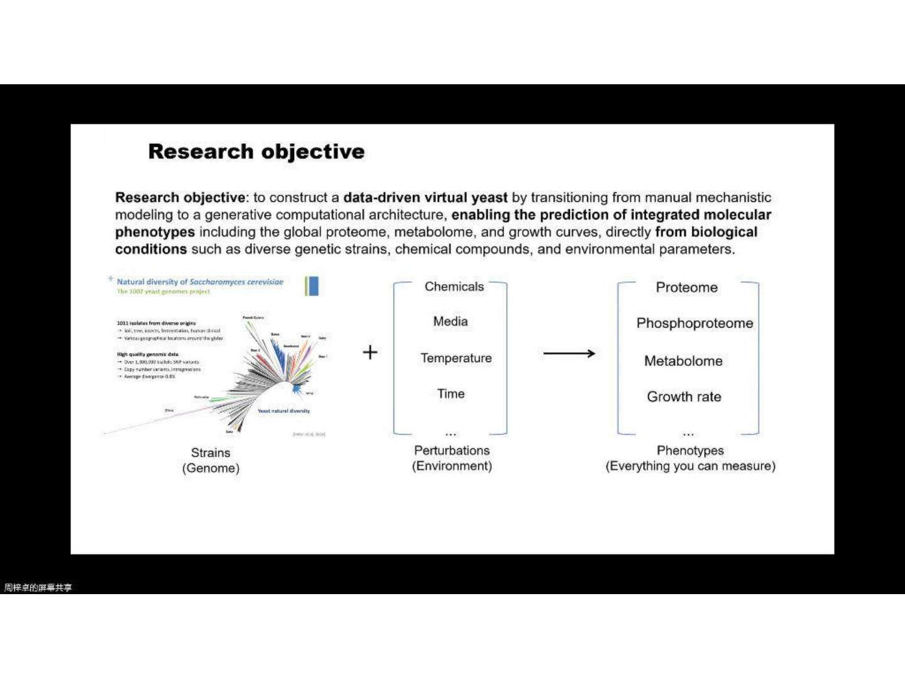

> **概要：** 项目总目标——从手工机理建模转向生成式计算架构，构建数据驱动的虚拟酵母。输入是「菌株（基因组）+ 扰动（化学/培养基/温度/时间）」，输出是整合分子表型（蛋白组、磷酸化蛋白组、代谢组、生长速率）。即用 1011 株天然多样性酿酒酵母（1002 基因组计划）作为基因型载体，直接从生物学条件预测分子表型。

所以第一阶段就是搭建这个数据集。目前是有 3 万个左右的、这几个维度组合起来的 proteome 数据集，然后这边是它的一些 QC 结果。主要的这张图，我们把这个 QC samples 用不同仪器跑的，给定它做了一个皮尔森 correlation（Pearson correlation），可以看到它有一个明显的三模态——就是我们用了三种仪器（QE、480 和 Astral），所以它是明显的三模态。那就意味着，决定你这个数据 variance 的大部分是由这个仪器决定的。那我们后面不管用什么模型，如果你想让它泛化得很好，你肯定是要考虑这个仪器的问题。

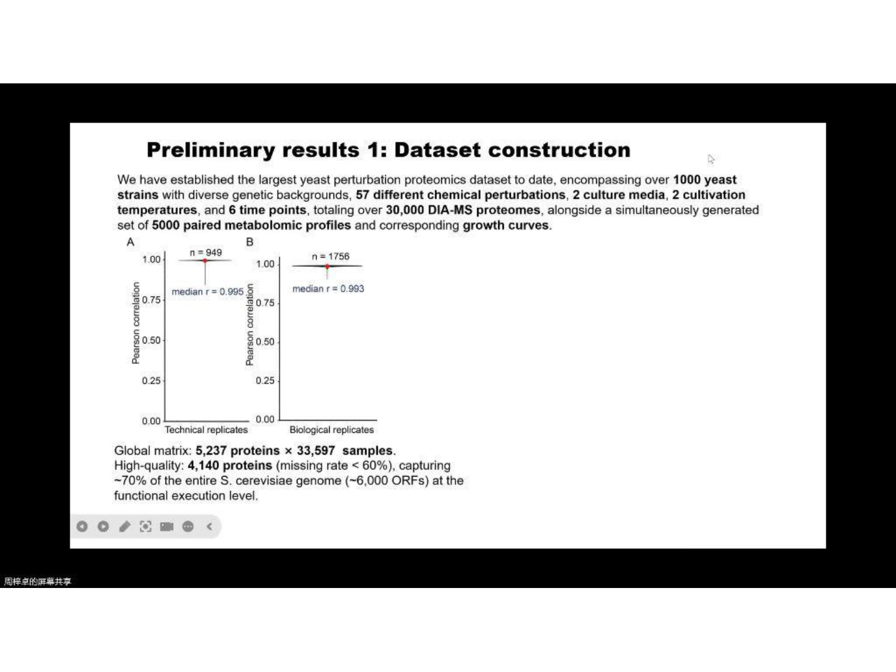

> **概要：** 第一阶段数据集成果——迄今最大的酵母扰动蛋白组数据集：>1000 菌株 × 57 化学扰动 × 2 培养基 × 2 温度 × 6 时间点，共 >30000 张 DIA-MS 蛋白组，外加 5000 配对代谢组与生长曲线。重复性极高：技术重复 Pearson r 中位数 0.995，生物重复 0.993。全局矩阵 5237 蛋白 × 33597 样本，高质量 4140 蛋白（缺失率 <60%），覆盖约 70% 酵母基因组。

> 后续加入 QC 的 CV 与跨 cohort 相关性图，揭示 QC 相关性的三模态分布，明确仪器批次效应为下游建模的关键混杂变量。
>
> 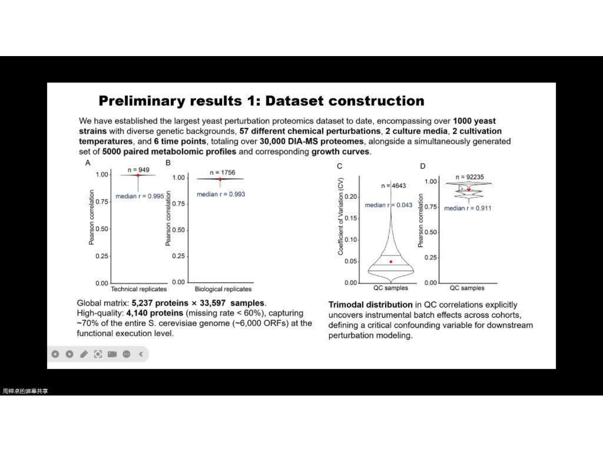
>
> **概要：** 在前一张基础上补充 C/D 两图：QC 样本变异系数（CV）中位数 0.043（重复性好），但 QC 样本间相关性（D 图）呈明显**三模态分布**（中位 r=0.911）。这一三模态对应三种仪器（QE / 480 / Astral），明确把仪器批次效应锁定为下游扰动建模必须处理的关键混杂变量。

然后第二阶段就是建模。模型的 input 就是这个 conditions，就是我们说的 strain 这几个维度，它其实都可以做（每个维度做 embedding）。比如 strain 可以用 DNA 的一些（基因组）模型来做，拿这个 genome sequence 去做 embedding；chemical 的话就拿 SMILES 做常见的方法。

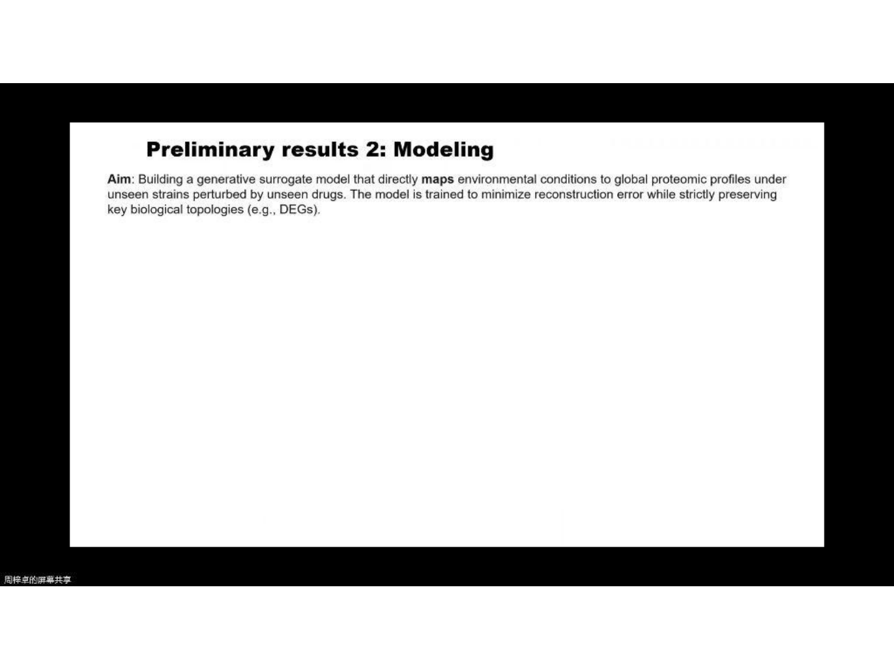

> **概要：** 第二阶段（建模）的目标陈述——构建一个生成式代理（surrogate）模型，直接把环境条件映射到全局蛋白组，并能在**未见菌株 × 未见药物**下做预测。训练目标是在最小化重构误差的同时，严格保留关键生物拓扑（如差异表达基因 DEG）。

——这是 30 个酵母菌株。有多少种？——我三十种。三十。对，我三十种这个酵母菌株。然后主要的这个 population 维度差不多是三万个左右，就是 30 × 48 × 2 × 6 × 2 这样一个组合。

然后 strain 的话，其实有一个挺平的数据集，18 年有一篇 Nature，那个 usef[?] 他们他从在世界各地收集了 1000 多种酿酒酵母的不同菌株，所以 strain 是可以（用的）。他们测了这个基因组，所以我们可以拿这个基因组做 embedding。

——为什么要用那种菌株呢？——是这样，你回到这个目的，这个目的本质上是要做一个 genotype（基因型）的预测。大家都不知道这个 virtual cell 到底是什么，那其实很大程度就是，用户从他们自己的菌株，如果想拿他自己的菌株做预测，那比较公平的一个比较是，你对它做一个基因组 sequence，这样我们的模型通过学习这些基因组 sequence 到后面表现的一些 map，就能支持你这个完全没见过的菌株的预测。

然后酵母的话，它类似于人的一个计划——它这个酵母叫 1002 这个 project，人的话是 1000（Genomes）project，还有一个最后落是 1001 project。什么意思呢？就是说同一个物种，我们拿差不多这 1000 这样的个体的基因组水平，去搭建一个整体的、一个物种的遗传库。所以是类似这样的一个思路。这 1000 种正好是有这个数据。当然这个酵母的种类肯定是远超于 1000 的，但它这 1000 种是从在世界各地（采集），他们有一个质性的方式，要求你这 1000 种的遗传多样性要足够大才能纳入进来。所以我们就认为这 1000 株它是一个非常 diverse 的 group，所以拿来做这个 virtual cell 学习的载体比较好。

——所以是 1000 种？——对。但是我们（实际用的不是 1000 种），因为你可以看到这是一个二维度的（笛卡儿组合），所以你 1000 种也乘进去乘以，这个体量非常非常大，而且一开始我们也不是 1000 种都搞。所以我们是从子株开始。先几种化合物开始，后面慢慢去加，然后通过这种 diversity 采样，从 1000 种里面去选出最具代表性的一些菌株。后面这 1000 株小于之后，我们拿它做了一个 baseline 的 protocol——就是没拿它测化学数动的 protocol。所以整体的数据集其实包含很多个 subset，其中比较重要的就是这几个维度的组合，加上这 1000 种菌株单独的 proteome。所以其实不同株，我们可能只有子株是（有化学数动的）。

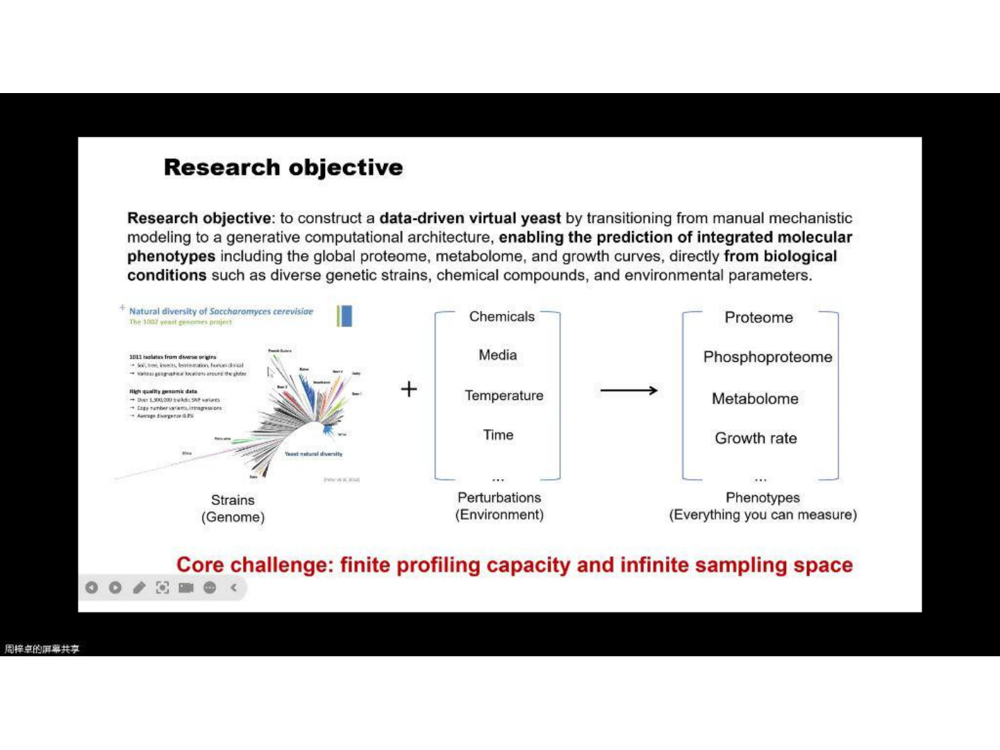

> **概要：** 与首页同一张研究目标图，底部点明**核心挑战：有限的检测通量 vs 无限的采样空间**（finite profiling capacity and infinite sampling space）。即菌株 × 扰动 × 条件的组合空间极大，实验无法穷举，因此需要模型在有限样本上学习并向未见组合外推。

——有 30 组。对，差不多是 30 × 48 × 2（两个温度）× 6（个时间点）。后面通过这一步分析发现，这个温度其实对它（影响不大）。差不多这样，就是我们不断在调、不断在迭代这个过程，去尽可能让这个数据的 variance 比较高，这样你做 OOD 外推的时候就比较好。所以本质上还是让它建得更多样。

然后这个（base）的模型架构其实很简单，我们对每个维度去做 embedding，做完 embedding 之后统一地把它合起来，然后把这个 batch 信息引入，得到一个所谓的 context memory tokens，然后再去用 attention 去重新出这个 proteome。这个模型可以认为是后面的一个基线，后面虽然有改进，都是基于它。目前来看，这个架构在是否转出去做的一些化合物外推这样的任务上，我们也测试过，它是（比这些方法）。比如 CPA 还要强的。

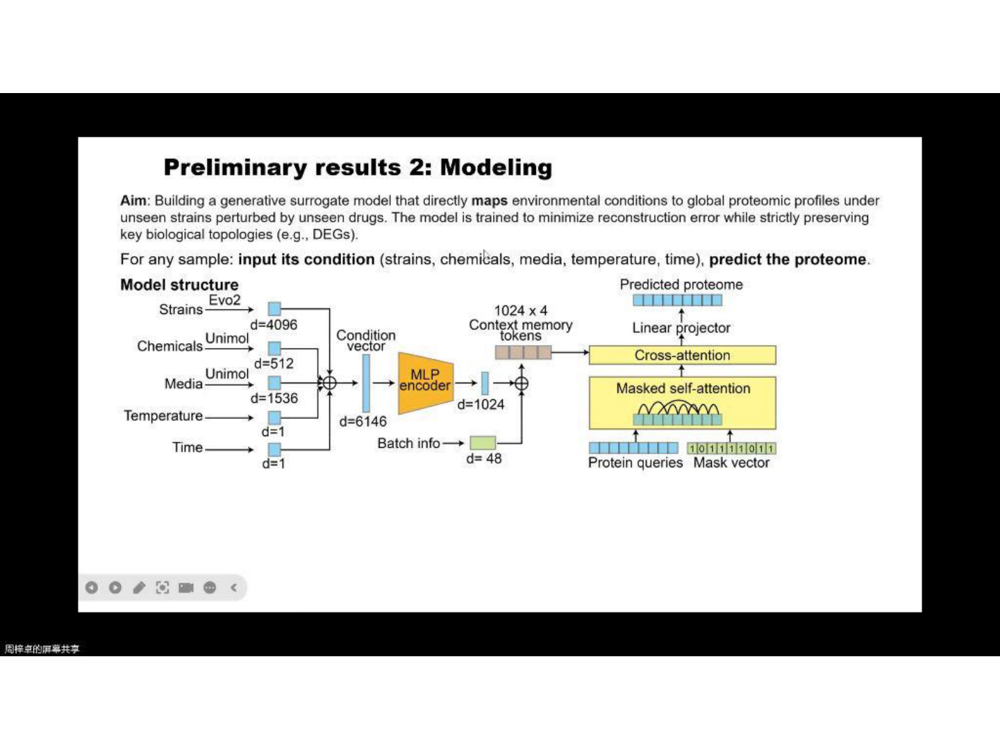

> **概要：** 基线模型（V0）结构。每个条件维度先各自 embedding：strain 用 Evo2（d=4096）、chemical 用 Unimol（d=512）、media 用 Unimol（d=1536）、temperature/time（d=1）；拼成 6146 维 condition vector，经 MLP encoder 压到 d=1024，再融合 batch info（d=48）得到 1024×4 的 context memory tokens；最后用 cross-attention + masked self-attention，由 protein queries（带 mask vector）经线性投影输出预测蛋白组。

然后 data sets split 这里就注意一点，我们主要拓展的 OOD 是在 strain 和 chemical 上做的，所以我们在划分数据集的时候用的是一种正交的方式。比如每个维度都单独去划，划分这些做 test，然后严格地控制这个模型见过的数据。所以一共就四种场景：都见过、只见过其中之一。以及最严格的两个都没见过。

然后模型结果差不多是这样，我们和这个 mean 做了一个对比，后面会有更详细的分析。大家可以简单看一下，这个就是 global R² 很高。为什么呢？因为这个 protein 的相似性非常高，你看到这个 mean baseline 就很高。但这个 mean baseline 是没考虑仪器的，所以你考虑仪器之后，这个 mean 会高一点，差不多就是 0.95 左右。就是说，这个 variance 主导的还是仪器主导，但你这个不同条件的酵母的影响实际上是比较低的，差不多这样一个结论。

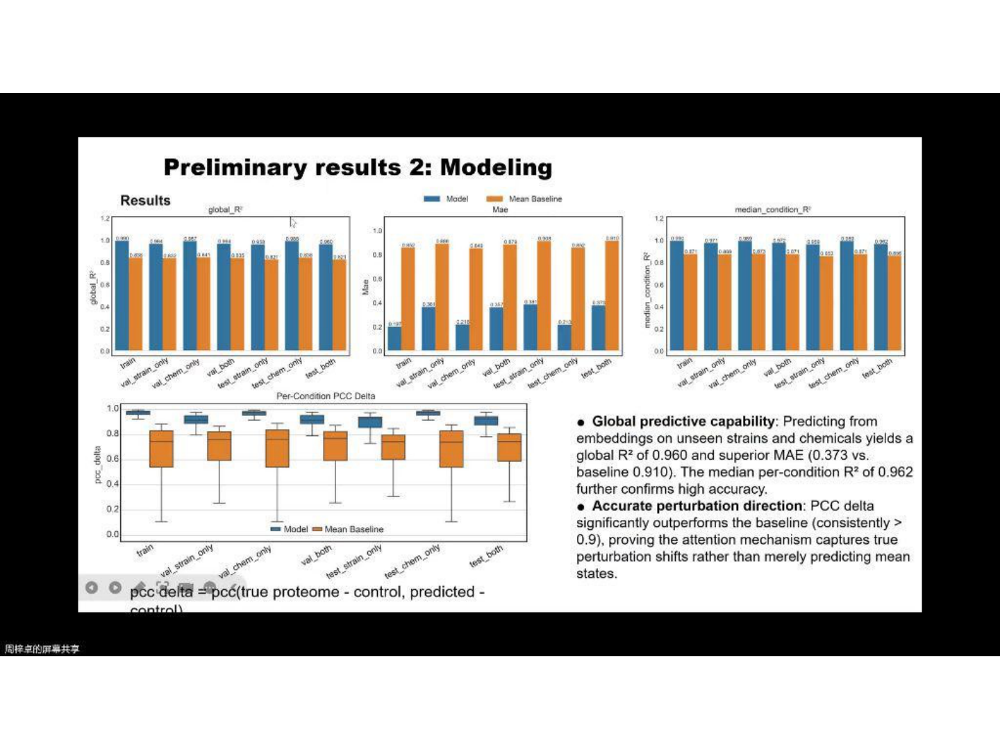

> **概要：** V0 在各 split（train / val·test × strain-only / chem-only / both）上的结果。**全局预测能力**：未见菌株与化学下 global R² 0.960，MAE 0.373（优于 mean baseline 0.910），median per-condition R² 0.962。**扰动方向准确性**：Per-Condition PCC delta 持续 >0.9，显著优于基线——说明 attention 机制捕捉到的是真实扰动偏移，而非简单预测均值状态。

然后这个（指标）没考虑就是不掉机器（的情况）。我们划分数据集的时候是考虑到三种仪器的，所以我们尽可能让每一种仪器都有一定的训练数据在里面。所以这个 test（集）本质上含有 Astral、480、还有 QE 这三种仪器的数据。然后你直接去算 global 值的话，相当于可以看到后面这个图——它的 correlation（这三种仪器之间同一个样本就比较低），所以它这个 R² 可能是由于仪器导致的。那仪器内部的这个 variance 还是比我们模型差，差不多在 0.95 左右。就只是想说一个意思，这个结果大家不用仔细去看，只需要知道一个趋势，因为后面这个模型会更新。这个趋势就是我们模型会比这个 mean baseline（MB3）要好，特别是即使你给它组合了三个之后，差不多这样一个思路。

然后后面我要提一点，现在计算 R² 其实有两种方式。一种是对 per condition 去算，就是每一个 condition 你会做出一个预测值（一个预测的向量和一个真实的向量），你去算这个 R²。另外一种就是更严格的，我们这里用的就是这种更严格的，是对每一个 protein。或者说你预测的这个 feature 去计算。在这种情况下，你的 mean 就不一定是 0，可以看到这个 R² 的计算值等于这个，当你的预测值等于这个均值的时候，那你的这个就是 0。所以什么意思呢？就是说在这种指标上，你的 mean baseline 不一定是 0，所以在这个图里面基本上你就看不到这个 mean。所以我们的模型——虽然这一版本是以 MSE 为 loss，它就会以这个 loss 的监督一路往上走，去靠近真实的预测值，同时我们模型选择是根据 median R² 越高来选择的，所以这种选择方法就让模型天然地就具有这种、超过 label[?]，（所以它会表现得比这个均值要好，而不是说收敛到这个均值）。

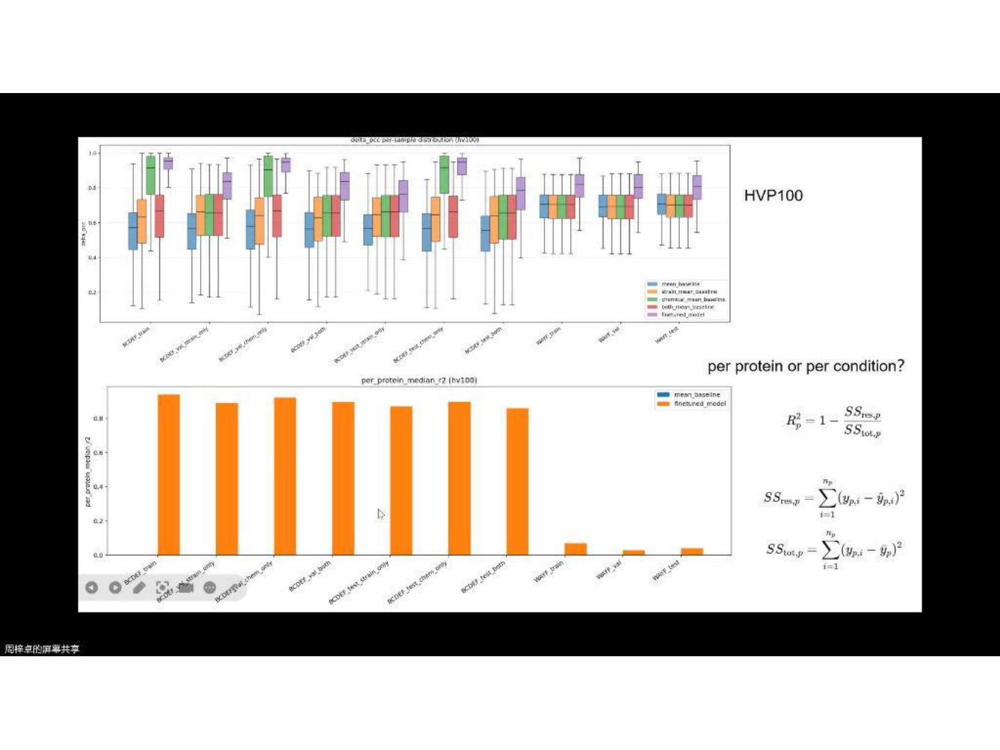

> **概要：** HVP100 子集上的更细评估。上图：各 split（BCDEF / WAYF 系列）的 per-sample delta_pcc 分布，finetuned_model（紫）整体高于 mean / strain-mean / chemical-mean / both-mean 各基线。下图：per-protein median R²，finetuned_model 在 BCDEF 各 split 上达 ~0.85–0.9，但在 WAYF 系列骤降到接近 0——引出右侧公式，强调「**per protein** 还是 per condition」两种 R² 口径的差异（per-protein 时 mean baseline 不再为 0、更严格）。

然后这里有一个经验，任何模型，你如果想做数动预测，用这个 per protein。或者说 per feature 的这种 R² 会更好一点，因为你的 per condition R² 跟 mean 之间可能就小于 0.95 以上——特别是 protein 它非常非常相似，长度也是一样的。

然后后面去做一些算法的比较，主要的这两个子图。我们用了和 CPA。然后 diffusion（就是吴大那边的 diffusion model），以及一些 mean baseline。更严格地去分类的一些 mean baseline，还有岭回归以及随机森林这样一些方法。主要的两个 test：一个是综合数动，综合数动上我们模型实际上跟这个（CPA 是）——其实 CPA 已经很强了，但我们确实是它高一点，再这个 AWAF[?] 这个 test 集就只有这个 strain 差异（就是之前说的，它有三十个酵，然后我们按 3:1:1 去划分），那它这个就是在靠 strain 的（泛化）。所以这个 per protein 维度的 R² 就非常难预测，但如果我看全局的话，可能这个均值就有 0.95，然后我可能是 0.96 左右，就是它高一点点。

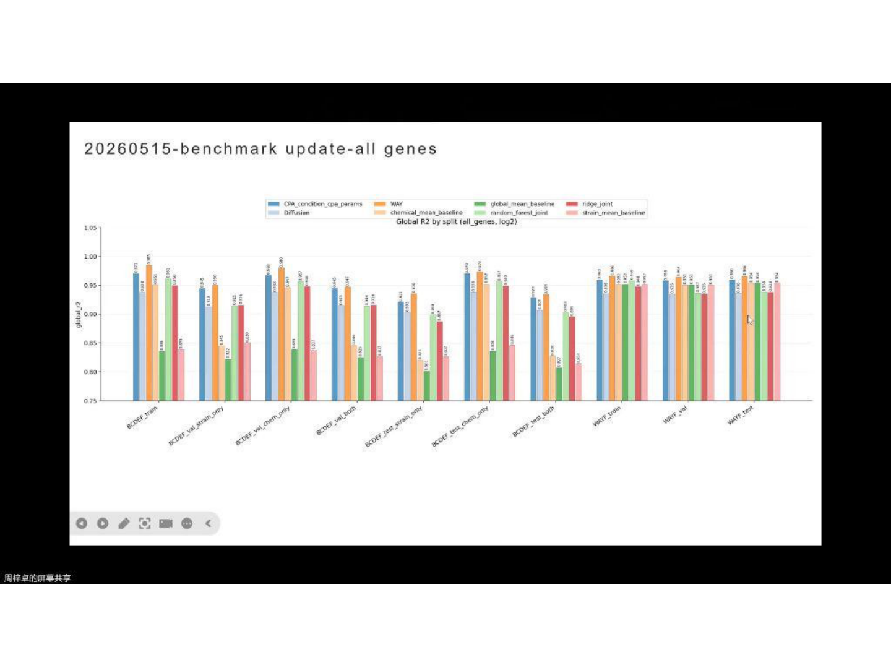

> **概要：** 2026-05-15 更新的算法横向 benchmark（全基因，log2）。对比方法包括 CPA、Diffusion、WAY（本工作）、global/chemical/strain mean baseline、ridge_joint、random_forest_joint。各 split 的 Global R² 普遍在 0.80–1.00 之间，WAY 与 CPA 处于第一梯队、略高于强基线——但此处只是基础尝试，**未做显著性检验**。

——没比。没比显著性。对，但是可以看出来。——对，显著性的话，确实，如果我们发文章的时候是要比一下的，但你现在只是基础（base）的一个尝试，所以没有算显著性。这不是终结，因为这个版本只能做 proteome，后面会说。

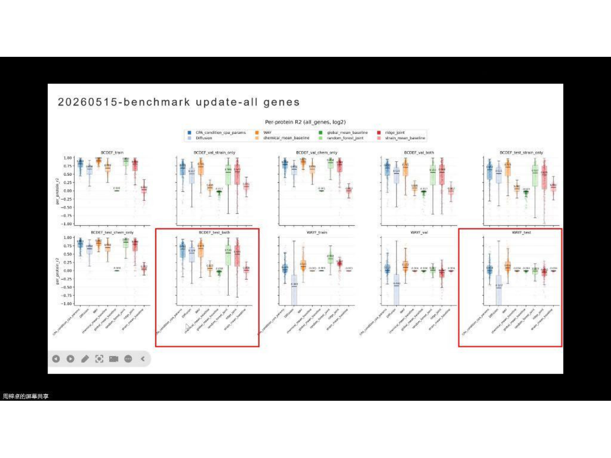

> **概要：** 同一 benchmark 改用更严格的 **per-protein R²**（全基因，log2）。10 个 split 的小提琴图显示：在见过的 split 上各方法仍较高，但红框标出的两个最严格 split（BCDEF_test_both、WAYF_test）上几乎所有方法都跌到 0 附近甚至为负——直观说明跨菌株/跨化学的 per-protein 外推是真正的难点。

> 同口径的 DEG100 per-sample delta_pcc 比较（红框同样标出 test_both 与 WAYF_test）。
>
> 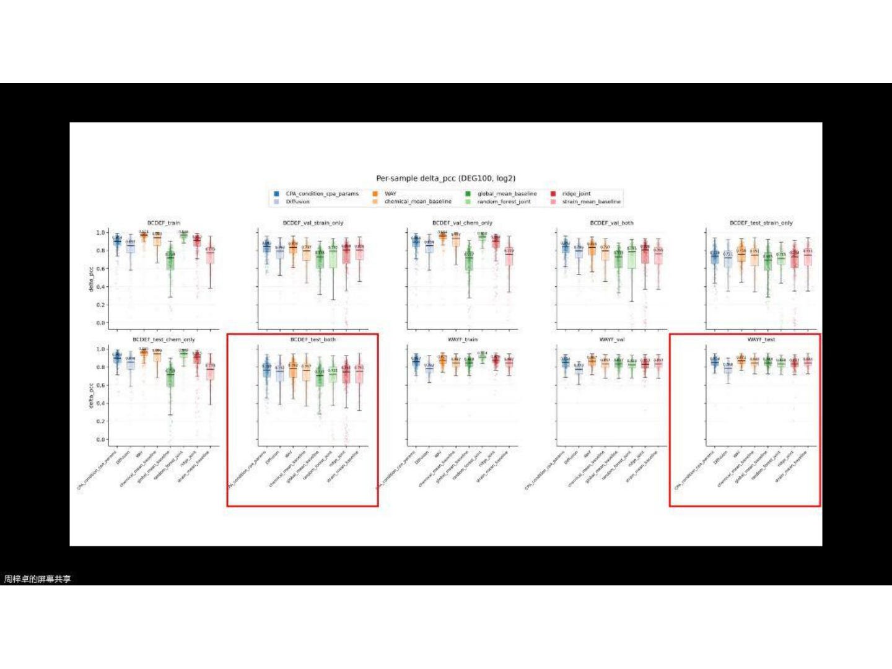
>
> **概要：** 换成 per-sample delta_pcc 口径（取 DEG100，log2）的同口径对比。各方法在 10 个 split 上的 delta_pcc 多在 0.7–0.95，差距不如 per-protein R² 那么悬殊；红框同样标出 BCDEF_test_both 与 WAYF_test 两个最严格 split，提示评估口径选择会显著影响结论。

所以除了这个版本之外呢，后面就加其他模态，比如代谢组。代谢组它有一个问题，你看这个不同点，就是我们做了一个不同 OD 的梯度，每一个 OD 梯度本质上应该是一个正相关的关系，但实际上你检测出来，会发现它 OD 高不一定这个丰度高。所以这个误差就导致，整个代谢组对比蛋白组来说——我们蛋白组会拿这个 peptide 去做一个统一的这样量（让它 DIA 的相对丰度是可以比的），但在代谢组上这个问题就很严重，即使是相同的 OD，你很难去提取出来一个菌的数量（就类似于你有多少样）。因为代谢组没有方法去简单地对这个代谢物用 A260/A220[?] 去算一个浓度，所以它到了这一步。那这一步我们就想人为地去做一个 OD 的梯度，在每一个菌的数量去获得一个代谢组的数据。

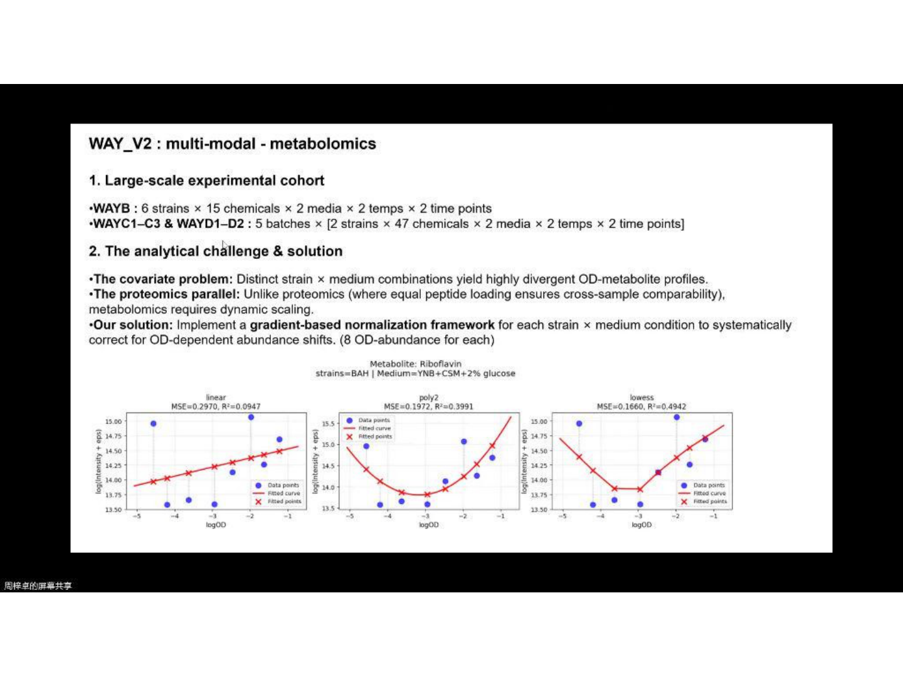

> **概要：** 加入代谢组模态（WAY_V2）。大规模 cohort：WAYB（6 株 × 15 化学 × 2 培养基 × 2 温度 × 2 时间点）+ WAYC/D 多批次。核心难题——不同 strain × 培养基组合的 OD–代谢物关系高度发散；与蛋白组（等量上样保证可比）不同，代谢组需要动态缩放。解决方案：对每个 strain × 培养基条件做**梯度归一化**（每条件 8 个 OD 梯度），图中以 Riboflavin 为例对比 linear / poly2 / lowess 三种拟合（R² 0.09→0.40→0.49），纠正 OD 依赖的丰度漂移。

然后我们实际做的时候，取样的时候会测一个 OD，再用这个 OD 去做数字（校正）[?]，但你会发现它本身就是一个不（够）准这件事，而且不同的代谢物它还不一样。所以后面建模的时候，同样的一个手势，我们就做了一个收（呃），把这个 batch 和这个 OD 去考虑——到底要不要考虑这个 OD，以及这个 V-norm 这个。就是说我们用一个梯度的数据去提取这个实验数据，但其实你会发现，实验最好的还是第一个。最原始的，就把（菌液）信息给定，不考虑 OD，这种情况下它反而表现最好。

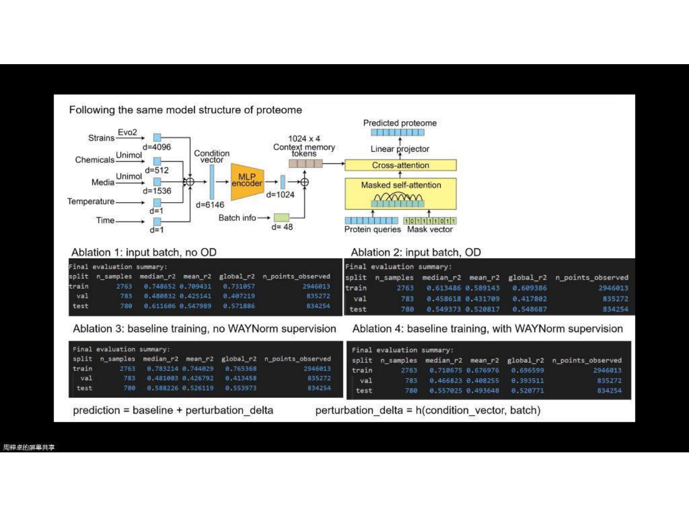

> **概要：** 代谢组沿用与蛋白组相同的模型结构，并做 4 组消融。Ablation 1（input batch，无 OD）test median_r2 0.612；Ablation 2（input batch + OD）0.549；Ablation 3（baseline 训练，无 WAYNorm 监督）0.588；Ablation 4（有 WAYNorm 监督）0.557。结论：**不显式考虑 OD 反而最好**（Ablation 1 最优）。预测分解为 prediction = baseline + perturbation_delta，其中 perturbation_delta = h(condition_vector, batch)。

然后模型架构也是同一个架构。后面介绍一下这个代谢组的效果，整体来说其实还是可以的。比如我们之前定了一些高价值代谢物，它在不同数动条件下 log2 尺度上的（表现）——这个 PCC 还是可以的，对，但它是 log 格式的东西，如果转成线性[?]的话，它可能没这么好。

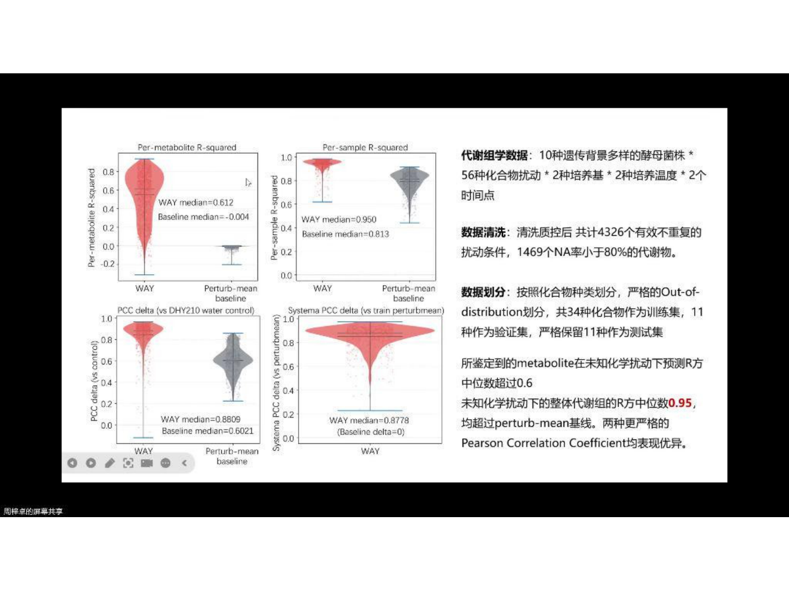

> **概要：** 代谢组整体结果。数据：10 株 × 56 化学扰动 × 2 培养基 × 2 温度 × 2 时间点，质控后 4326 个有效不重复扰动条件、1469 个 NA<80% 的代谢物；按化合物种类做严格 OOD 划分（训练 34 / 验证 11 / 测试 11）。在未知化学扰动下：per-metabolite R² 中位数 0.612（WAY）vs baseline −0.004；**per-sample（整体代谢组）R² 中位数 0.95**；PCC delta（vs control / vs train perturbmean）两个更严格指标均优于 perturb-mean 基线。

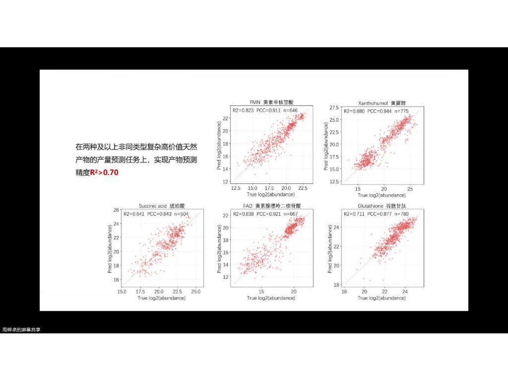

> **概要：** 在多种非同类型复杂高价值天然产物的产量预测上，达到 **R² > 0.70** 的预测精度。5 个散点图（True vs Pred log2 丰度）：FMN R²=0.823 PCC=0.911、Xanthohumol R²=0.880 PCC=0.944、Succinic acid R²=0.641 PCC=0.843、FAD R²=0.838 PCC=0.921、Glutathione R²=0.711 PCC=0.877。说明模型对工业关注的代谢物有实用预测能力（注：此为 log2 尺度，转线性后可能略降）。

然后这个是生长曲线，有 1000 多个生长曲线的测试集。你可以看到这个生长曲线，有时候它其实很难测，比如看这个第一个，它到末期可能是仪器的问题，突然就有一个 spike——这个 spike 应该是仪器的误差，那其实很难说被任何模型预测出来，但这样的情况还挺多，所以目前数据清洗的策略还是把这些保留了。但也有预测比较好的，比如看这种，它就可以预测——它这个 y 轴，就是最终的 OD 值，还是比较准的。一开始我会担心说它会不会每一个条件都给你一个相同的终点，但其实不一样，不同的 chemical 它终点还是有差值的，模型在（某）一些情况下可以预测得比较好。整体情况差不多这样，每一个条件的 R² 差不多 0.85 左右。

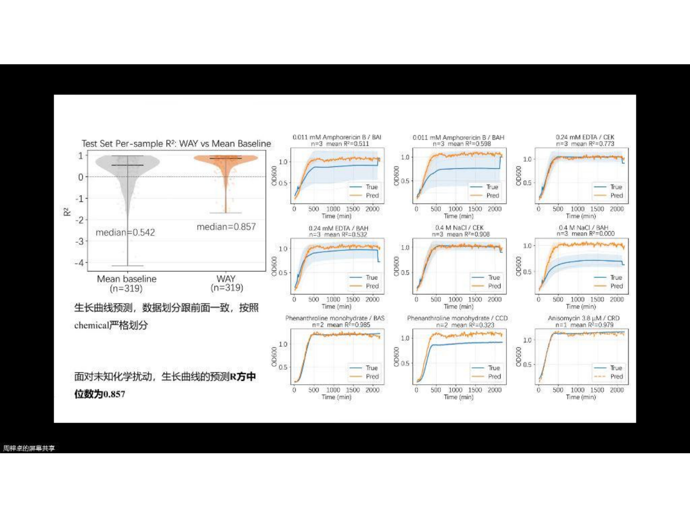

> **概要：** 生长曲线预测，数据划分与前面一致（按 chemical 严格划分）。面对未知化学扰动，测试集 per-sample R² 中位数 **WAY 0.857 vs mean baseline 0.542**（n=319）。右侧 9 个「化合物/菌株」条件的 True（蓝）/Pred（橙）OD600 曲线示例：多数终点拟合较好（如 0.4 M NaCl/CEK R²=0.908、Phenanthroline/BAS R²=0.985），少数受仪器末端 spike 等噪声影响较差（如 0.4 M NaCl/BAH R²≈0）。

后面其实我们现在有了这些数据，那就会考虑去做一个 foundation model。我之前大致估了一下——这个是 GPT 总结的——我让它去估了一下这些已开源的 human cell 的 single cell 数据。但我估的不是总体，我说你要给我估一下数动条件，比如很多时候你 single cell 一个条件会测很多个细胞，一个条件测 2000 个细胞。或更多，那其实你的数动条件是有限的。然后估算了一下，差不多 human 这个水平也是 10 万到几十万的量级。那对于比 human 简单很多（甚至更多）的酵母生物，我们现在已经接近 10 万 level 了，所以实在可以说做一个放近去 model 的版本。

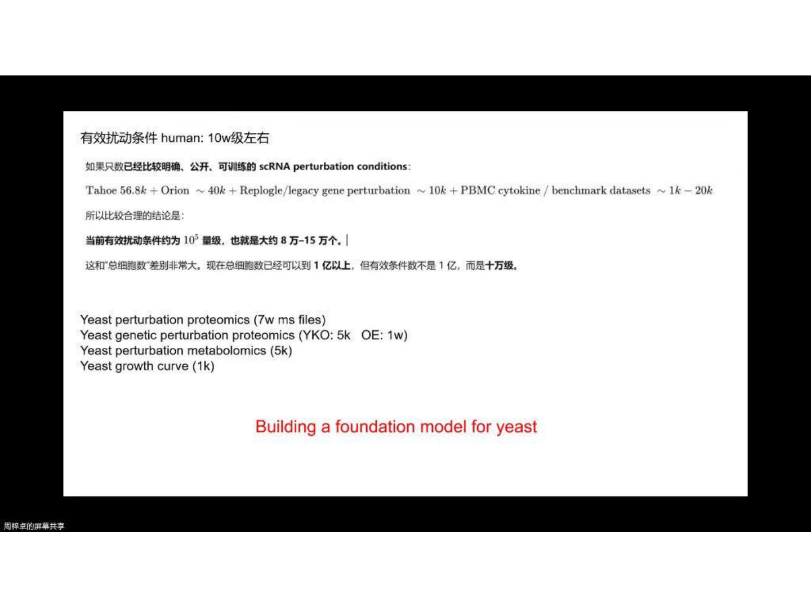

> **概要：** 论证「做 foundation model」的可行性。按**有效扰动条件**（而非总细胞数）估算：human 已公开可训练的 scRNA 扰动条件（Tahoe 56.8k + Orion ~40k + Replogle/legacy ~10k + PBMC/benchmark ~1k–20k）约为 10^5 量级（8 万–15 万），远小于「总细胞数」（已过亿）。而本项目酵母数据已接近该量级：扰动 proteomics（7 万 ms files）、基因 KO proteomics（YKO 5k、OE 1w）、metabolomics（5k）、growth curve（1k）——因此「为酵母构建 foundation model」时机成熟。

然后就是说，我们现在前面这些所有的数据都是基于一套模型——就是前面讲过的，把 condition 用不同维度去做 embedding，然后给定拼起来去输入，用 MLP 去压缩，压缩它之后拿这个 Transformer 去提取这个数据。因为 Transformer 它有一个 cross attention，可以考虑到这个 context（就是这种环境下对某个蛋白有什么影响），以及 self attention 可以看这个 PPI（protein-protein interaction）的一些表达，所以它这种机制不会 somehow——虽然比较简单，但已经能够达到一个比较好的效果。

然后这里讲一下，data 差不多就这样，我也不再细讲。我们也搞这个基因敲除的数据，这个 coverage 会比 human cell 的要大很多，因为 human cell 差不多是 2 万个，最大的是 surge 1300 个，而我们是 6000 个基因敲了 4000 多个，通过质性的有 3800 个，所以我们这个数据的 coverage 肯定是更高的。然后代谢组以及生长曲线是这样。

然后为了让这个模型更好，我们做了严格的划分。我们这一版本还抠了一些时间点出来去看它这个时间点的泛化。主要就是几个指标，strain only、chem only、以及 both。还有这个 time。这个是 V0，就是前面这个模型架构在四个子任务的一个结果，这个是 median R²——median R² 会比较严格，所以我们用的是 median R²。

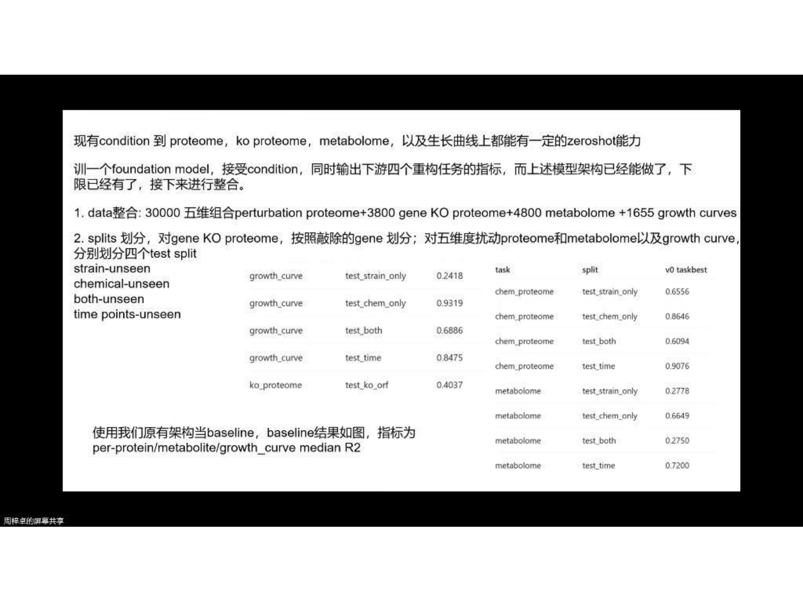

> **概要：** Foundation model 的数据整合与划分。数据：30000 五维组合扰动 proteome + 3800 基因 KO proteome + 4800 metabolome + 1655 growth curves。划分：KO proteome 按敲除基因划；五维扰动 proteome/metabolome/growth curve 各划 4 个 test split（strain-unseen / chemical-unseen / both-unseen / time-unseen）。右表为用原有架构作 baseline 的 V0 taskbest（per-protein/metabolite/growth median R²），如 chem_proteome 0.66–0.91、metabolome 0.28–0.72、growth_curve 0.24–0.93、ko_proteome 0.40。

然后后面会考虑一个事情，我们前面说了，三种仪器之间的 correlation 非常非常低，即使你是同一个样本，所以它的主要来源就在这个批次上。那其实你这一步去 train 一个分类器，这个分类器只接受这个 protein 数据，就可以给你判断是哪种仪器，而且这个准确率几乎是 1。什么意思呢？甚至说我只输入这个 mask——就是哪个 protein 有、哪个 protein 没有，只用 mask，即使你 QE 跟 480 仪器之间非常接近，那你这个 accuracy 也能达到几乎是 1 的水平。也就是说，它整体的这个观测量就来自于你的仪器。

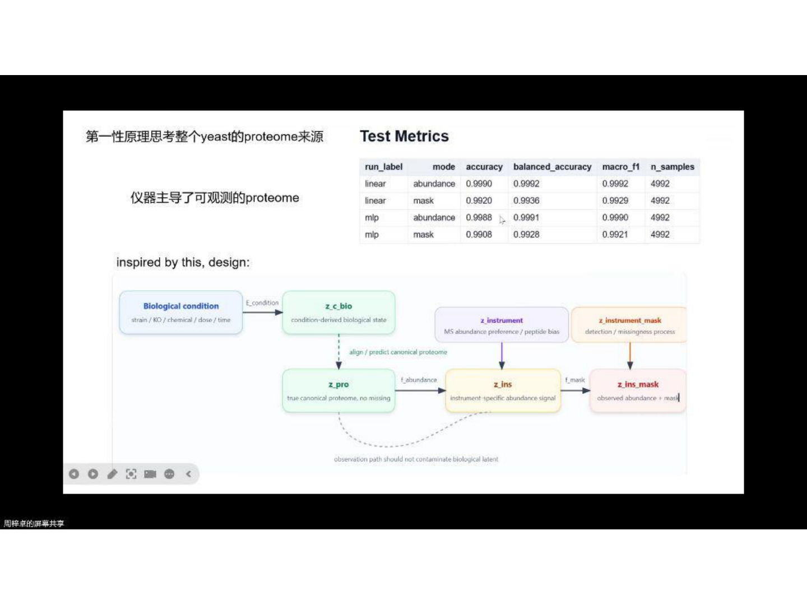

> **概要：** 用第一性原理思考整个酵母 proteome 的来源——结论是**仪器主导了可观测的 proteome**。Test Metrics 表：仅用 protein abundance 或甚至仅用 mask（哪个蛋白有/无）训练分类器，就能近乎完美判别仪器（linear/mlp × abundance/mask 的 accuracy/balanced_accuracy/macro_f1 均 ~0.99，n=4992）。据此提出生成路径设计：Biological condition →(E_condition)→ **z_c_bio**（条件派生的生物状态）→(对齐/预测 canonical proteome)→ **z_pro**（真实无缺失蛋白组）→(f_abundance)→ **z_ins**（仪器特异丰度信号）→(f_mask)→ **z_ins_mask**（观测丰度+缺失）；强调观测路径不应污染生物 latent。

所以我们就把这个事情做了一个理解，你真正的这个酵母的 protein 来自于哪里。我这边做了一个假设，首先它有一个条件，这个条件是客观的——你这个酵母是哪一种菌、有没有 KO、有没有化合物数动、处理时间是多少、温度多少。那这种条件，我认为它可以发送一个（编码器）得到一个理想的 z_bio 空间，这个空间纯粹代表了条件信息，理论上不应该含有任何（仪器）信息在里面。第二个，我认为会有一个理想的 protein，就是你这个酵母在这种数动条件下，它一定会对应它自身的一个完美的 protein，这个 protein 是虚拟的，应该是所有 protein 都有的、一个真实的数据。

那从这种真实的 protein 到我们观测到的 protein，它要过两层：第一层是这个仪器对这个 peptide 本身的一个偏好，比如 QE 测某个 protein 就丰度比较高（你只能看不同条件的差值），Astral 可能这个丰度就低，是这个意思；第二层就是它会过一个 mask，就是你 Astral 的鉴定量会比 QE、480 都要大很多，差不多有 1000 个蛋白是前面两种仪器测不到的，这种就是你这个仪器特异性的所谓 mask 模式。那其实我这个事情想表达，我们观测到的是这两层，但后面如果要预测的话，理论上要对齐的是这一个（理想 protein）。所以把这个仪器（影响）打开之后，我们就会想，你仪器搞这么多，那你之后那个模型就（难学），它学到的也是一个仪器（的东西）。所以就想，能不能换一种思路去搞这个事情。

所以这边就有一个双向编码器的架构，我们有一个 condition，这个 condition 通过一个高斯过程来弄一个 MLP，然后得到一个 latent space，这个 latent space 仅代表你这个生物学信息；第二个就是我们观测到的 protein，这个 protein 同样经过一个简单的 MLP，得到一个后验的 latent space，这个 latent space 应该是一个真实的 latent space，没有仪器的编号。那这两个——这个真实的生物学信息和你真实的 protein 信息，这俩应该是比较能够拉得很近的。然后它对齐之后，你再去接下面的这些 decoder，这个 decoder 你可以给定一些 batch 的（信息），因为我们也想让它能够提取得更好，基本上是这个思路。

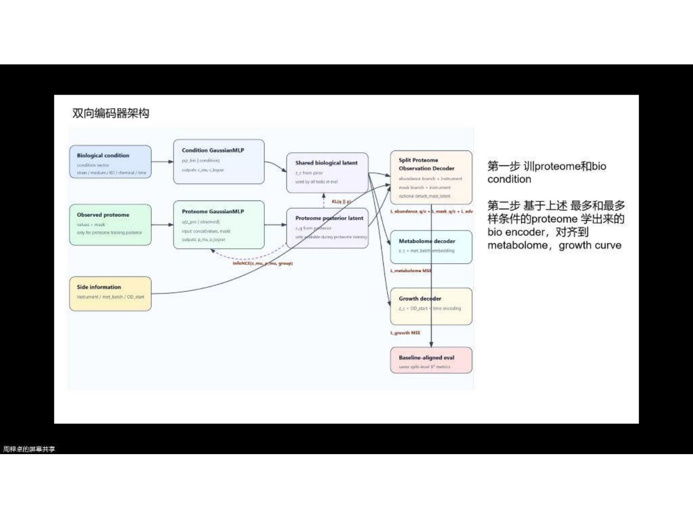

> **概要：** 双向编码器架构。两条编码路径：① Biological condition 经 Condition GaussianMLP（p(z|bio condition)）得到共享生物 latent **z_c**（先验，所有任务评估时都用它）；② Observed proteome（values+mask）经 Proteome GaussianMLP 得到后验 latent **z_q**（仅训练时可见）。两者通过 KL(q‖p) + InfoNCE(c_mu, p_mu, group) 对齐。下游接 Split Proteome Observation Decoder（abundance 分支 + mask 分支 + instrument，可选 detach_mask_latent）、Metabolome decoder、Growth decoder（z_c + OD_start + 时间编码），side information 提供 instrument/met_batch/OD_start。两阶段：第一步训 proteome 与 bio condition，第二步基于最多最多样条件学好的 bio encoder 对齐 metabolome / growth curve。

然后我们把这个事情解要了，因为我们数据最多的是前面这个组合数动的数据，然后代谢组差不多是它十分之一，生长曲线差不多会更少。所以第一步我们把这个 proteome 的空间给定训起来，拿它去作为一个整体的监督，之后我们把这个 encoder 去（冻结）起来[?]，让它基于这个学好的 encoder（在大空间里学好了编码器），直接去接其他的代谢（组），让它去预测。就类似于这两个 latent space 理论上是同一个事情（你的真实的生物学信息应该就能够通过一个简单的线性映射对应过去）。

——你说这个吗，这个是 KL 散度去控制的，就是衡量两个分布之间的距离。然后还有一个 InfoNCE here，对，在这（条线）。后面其实会讲得更清楚，因为这个图比较丑，它这个线绕得有点（乱），后面会讲一个更精致的图。这边就先大致过一下，我们即使拿这种简单的架构（全部都是 MLP，所有的 encoder、decoder 都是 MLP），它都能够比之前这个 Transformer 要接近（水平至少是接近），然后在代谢组上还是 Transformer 更好。但我们在训练上就非常不一样——Transformer 如果我要做四个任务，一张 A100 要搞三天，搞可能还不够，但我这个 V3、V4（纯 MLP），它搞得非常快，4GB 显存、两小时，你本地就可以跑。所以这就说明我们这个优化的方向是对的，我们放弃地去考虑这个仪器的误差，通过这一条路径，确实把它最后搞出来之后，再让它去纯学仪器会更好，即使是 MLP 也会更好。

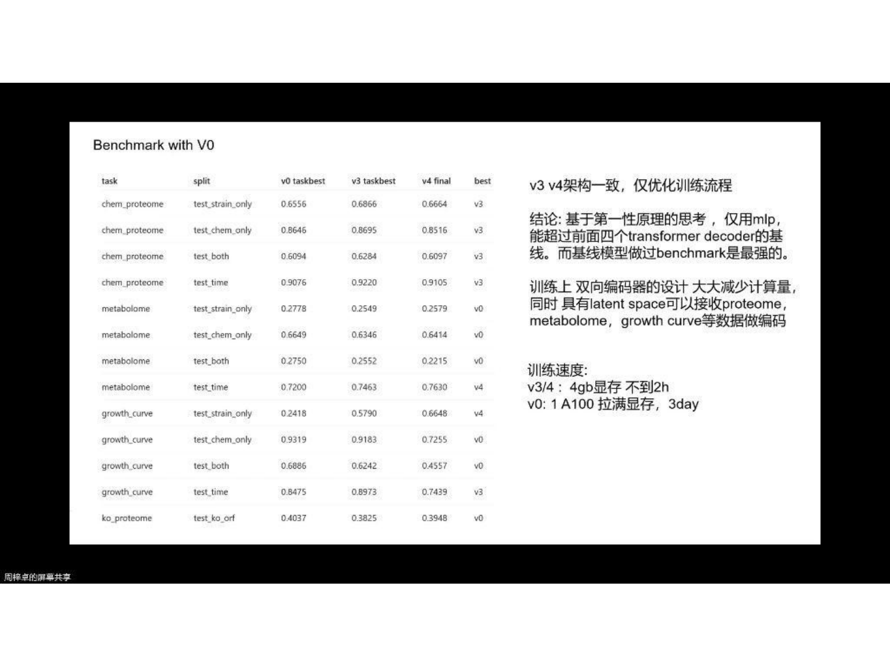

> **概要：** 双向编码器（v3/v4）与 V0 的 benchmark。表中 v0 / v3 / v4 各 task×split 的 taskbest 与「best」列：chem_proteome、metabolome、growth_curve、ko_proteome 上 v3/v4 多数与 V0 持平或更优。结论：基于第一性原理**仅用 MLP** 即可追平/超过前面四个 transformer decoder 基线（而基线模型是做过 benchmark 中最强的）。双向编码器大幅降低计算量，且 latent space 可接收 proteome/metabolome/growth 编码。**训练速度：v3/4 仅 4GB 显存、<2h（本地可跑）；v0 需 1×A100 满显存、3 天。**

然后后面就是说，我们在数据集搞上已经 OK 了，那后面就需要引入一些衡量 latent 的指标。这里就是写一些常见的 latent 指标，不是重点。重点就是说，V3、V4 本质上是（基础版本），V5、V6 我们在 V3、V4 的基础上去改了一些（结构），我们引入了这个 Transformer Encoder 和 Transformer Decoder，我们发现 Encoder 对它帮助更显著，而 Decoder 还有一个问题，就是计算量太大了——它要算 attention 的话，这个复杂度是平方，所以计算量比较大。

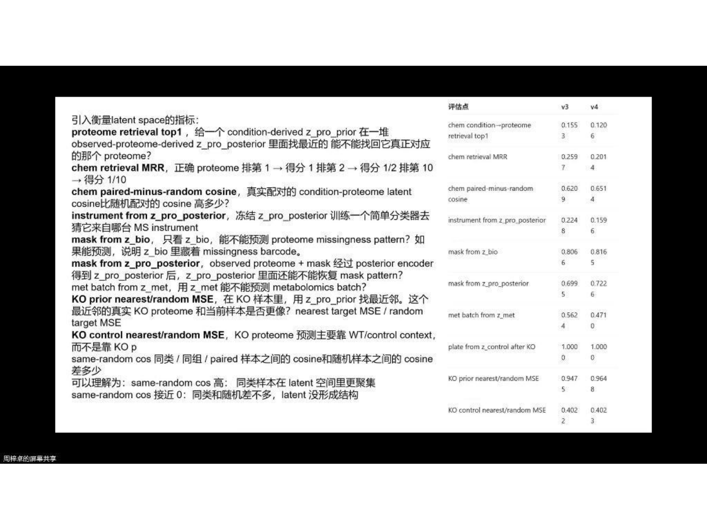

> **概要：** 引入一组衡量 latent space 质量的探针指标（v3/v4 数值对比）。包括：proteome retrieval top1 / MRR（条件派生 prior 能否检回真正配对的 proteome）、chem paired-minus-random cosine（真实配对比随机配对的 cosine 高多少）、instrument from z_pro_posterior（冻结后验训分类器猜仪器，越低越说明仪器信息被剔除）、mask from z_bio / z_pro_posterior（latent 里是否藏 missingness barcode）、met batch from z_met、KO prior/control nearest vs random MSE 等。理解：same-random cos 高=同类样本在 latent 更聚集；接近 0=latent 未形成结构。

那后面其实从 V3、V4、V5、V6 到 V7 有一个大的改进，就是我们前面发的这个事情，本质上不是多模态对齐——在这个架构上，你对齐的是一个虚拟的模态（condition 模态）以及 proteome 模态，本质上还是一个单一模态的事情。所以后面 V7 就是把这个代谢组、生长曲线的 latent space 以及这个 proteome 的 latent 空间去算一个动态对齐。所以这边在 V7 这个版本加了一个（机制），让这几个共享的空间都变得可学，而不是说继承这个 proteome 的空间，它就会让这个数据变得更好，基本上就提了一个 level。特别是化合物数动上、组合数动上的这个 R² 会变得更高，尤其是在 strain 上，它把这个 strain 上提升起来之后，会导致我们（整体的）也会变得很高，还有生长曲线也会高很多。

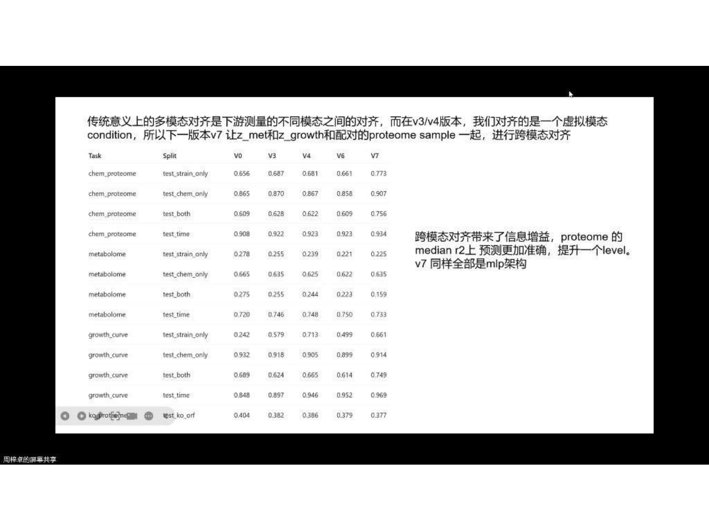

> **概要：** 关键改进点。传统多模态对齐是对齐下游测量的不同模态，而 v3/v4 对齐的只是「虚拟模态 condition」与 proteome（本质仍单模态）。**v7** 让 z_met、z_growth 与配对的 proteome sample 一起做真正的跨模态对齐。表为 V0/V3/V4/V6/V7 各 task×split 的 median R²：跨模态对齐带来信息增益，proteome 的 median r2 明显提升一个 level（如 chem_proteome test_strain_only 0.656→0.773、test_both 0.609→0.756；growth_curve test_strain_only 0.242→0.661）。v7 同样全 MLP 架构。

但代谢组上还是一个问题，代谢组的这个就是我之前专门有一张 slide 讲过——它本身这个 OD 的变化，somehow 它整个一个随机过程，不是说你对每个代谢物都算一个 OD 的关系你就能提取出来这个事，因为每一个代谢物它这个方程都不太一样。然后你如果想贴这个数据更近，那你不考虑 OD 反而能够预测得更准。所以代谢的这个差，我认为是数据本身的差，而不是这个架构有问题（架构是没问题的）。

然后后面比较详细地去讲一下现在这个架构，也就是说我们做一些梳理。这个标题可以不看，就是说我们还是把这个事情想成是一个条件引导的事，这个 condition 来了之后，它会（得到）这个 z_bio 空间，这应该是纯粹的，纯粹定义后，我们观测到的这个 protein，它是经过两层仪器影响、甚至是后处理的影响得到的。那你要学一个 encoder，就是把这俩对齐——你的真实 protein 和你的真实 condition 应该是能够对上的，通过一个简单的函数关系就应该能对上。你要问我为什么它能对上，我只是说这可能就是一个生物直觉，就是我们要做这样的假设，如果不做这样的假设，这个事可能就没法做了。

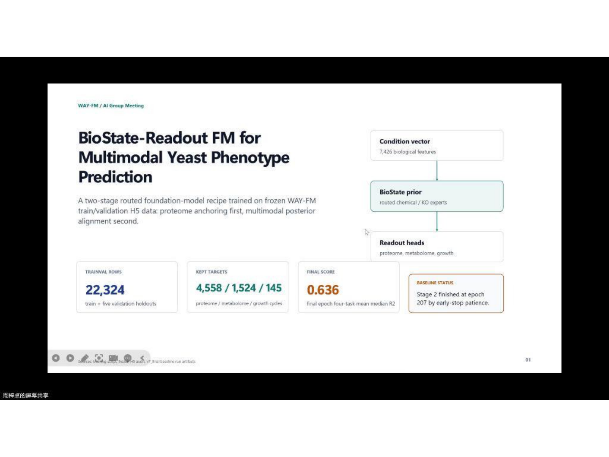

> **概要：** 当前 foundation model 方案的封面与总览——「BioState-Readout FM」。两阶段 routed 配方：先 proteome anchoring，再多模态 posterior alignment，训练于冻结的 WAY-FM train/val H5 数据。流程：Condition vector（7426 生物学特征）→ BioState prior（routed chemical/KO experts）→ Readout heads（proteome / metabolome / growth）。关键数字：trainval 22324 行（train + 五个验证 holdout）、kept targets 4558/1524/145（proteome/metabolome/growth cycles）、final 四任务 mean median R² **0.636**、Stage 2 在 epoch 207 因 early-stop patience 终止。

后面就是通过这个 z_bio，同时去让下游的几个训练模型给定对齐，对齐完了之后，你再加这个概率信息进来，它就能够得到这个观测值，让它去提取这个观测值。所以我想说的是什么呢？通过这样一种方式，第一，我们这个（latent）的值会更准；第二，我们能够做之前模型做不到的事——我们现在拿这个 latent space。对吧，大部分的 foundation model 它搞什么用？它就是拿这个 latent space 做下游任务。所以我们现在搞了这个下游任务，同时搞一个模拟的。还不掉 decoder，甚至是之前更好。

> **概要：** 模型架构精细版——把「生物学」与「观测过程」分离。Condition blocks（strain / context / chemical·KO）→ Routed BioConditionEncoder（strain encoder + context encoder + chemical expert 或 KO expert，fusion → **z_bio**）→ 三个 projector 得到 z_pro / z_met / z_growth → 分别接 Proteome observer（instrument + plate + mask head）、Metabolome observer（batch embedding）、Growth observer（OD_start + 时间编码）。核心思想：**生物学预测 latent 模态状态，observer 吸收测量过程**。Stage 2 对齐：当目标被观测时，posterior encoders（p_mu/m_mu/g_mu）通过 KL + NCE 与模态先验对齐，提供 latent 锚点。

然后后面这个就是训练策略，还是我们先训 proteome，但训它这个 proteome。它一个大库调（参）之后，之前的版本是让它不可学，现在版本就是把它改得可学，让它第二阶段去做这个动态对齐，把这几个维度的 pair 的数据让它在隐空间里给定靠近，认为这个 encoder 是代表同一个东西。同时它这个计算量也会变得非常低。然后之前我还搞过一步，第一阶段就是把所有的（参数）都打开，让它全训，但最后发现这个事它实际上是一个负影响，会让它变得更差。

> **概要：** 两阶段训练课程。**Stage 1 proteome_pretrain**：用 chemical proteome + WAYG KO proteome 锚定生物先验与 proteome readout，可训模块为 bio_encoder、proteome projector/posterior、proteome observer、instrument adversary。→ checkpoint 传递 → **Stage 2 multimodal_align**：载入 Stage 1 checkpoint，联合优化 chem + KO + metabolome + growth 及配对 latent 对齐，每 epoch 额外 100 个 paired alignment batches。运行设置：每 epoch 400 task batches、100 alignment batches、batch size 48/GPU、AdamW lr 1e-4、weight decay 1e-5、early stop patience 50。**注意：v7_final 刻意去掉 Stage 3 / joint_finetune，最终 checkpoint 即 Stage 2 多模态对齐 checkpoint。**

然后这里就是 loss 是哪些。第一个是 reconstruction loss，这个最后讲一讲，我们模型现在有两条路径。第一条路是左边直接连接，就是说这个 condition 定了之后，通过你预训练学好的权重，能够直接得到这个预测值。第二种就是把观测到这个数据，类似于搞一个 AE，把它压缩到一个隐空间里，再从这个隐空间里往回解码——但我们只 input 这个 train 这个 data set。所以我中午还跟（同事）浩讨论这个事情，这两条路径本质上 somehow 是有一个互相促进的过程。为什么这么说呢？如果你只有 AE，你是没办法支持你从条件直接外推的；但你如果只有条件直接外推，这个过程可能比较难训，因为它两个的数据是立差得比较远，但你如果加一个 AE 的话，它在初始化的时候会给定一个好的起点——因为 AE 本质上你只要能预测好，你这个 latent space 不会跑得特别远，它会直接让你从这个不会跑得特别远的 latent space 上再去做训练。所以这俩是一个相互促进的事情。我不知道我有没有讲清楚，反正我觉得这个事情应该是可以理解的。

所以这里的 loss 就加了两个，第一个就是重构 loss，就是你这个 encoder 压缩你原始的 proteome。然后再解码再往回（算）这个损失有多少；第二个是 predict，就直接从你前面的 condition 直接推出来的这个 loss。然后还有一个 mask loss，这个 mask loss 主要是干仪器的——因为你仪器之前讲了，用仪器可以直接把这个预测出来，所以这里有一个 mask 的 loss，就是我们让它真实的 protein 过这仪器的编号之后，再过一遍这个 mask 的 pattern。第二个就是 KL 散度，就是说这些——那个 condition 和这个 protein 之间的距离，应该分布越来越近越好。然后 NCE，这是比较常见的一个 loss，也是去衡量这两个模拟的分布，然后 Cross-NCE 就是第二阶段引入的。这三个模拟之间的一个事情。

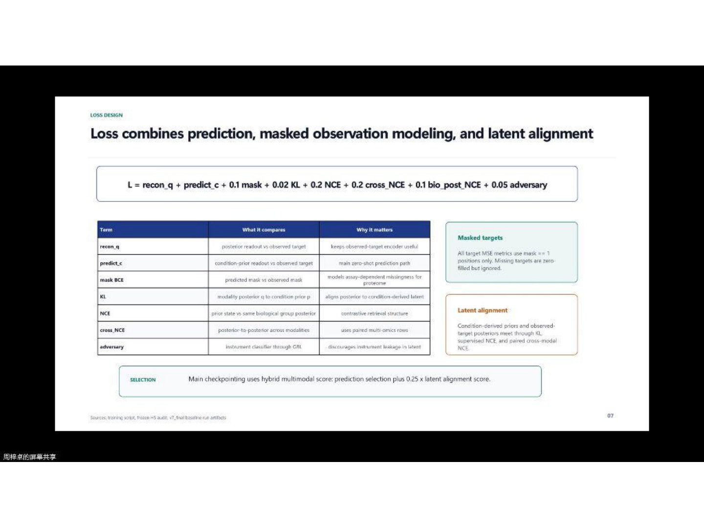

> **概要：** 损失设计——结合预测、掩码观测建模与 latent 对齐。**L = recon_q + predict_c + 0.1·mask + 0.02·KL + 0.2·NCE + 0.2·cross_NCE + 0.1·bio_post_NCE + 0.05·adversary**。各项：recon_q（后验 readout vs 观测，保持后验 encoder 有用）、predict_c（条件先验 readout vs 观测，**主零样本预测路径**）、mask BCE（预测 mask vs 观测 mask，建模检测缺失）、KL（模态后验 q 对齐到条件先验 p）、NCE（对比检索结构）、cross_NCE（跨模态配对后验对齐）、adversary（仪器分类器经 GRL，抑制仪器信息泄漏到 latent）。所有目标 MSE 仅用 mask==1 位置；主 checkpoint 选择用 hybrid multimodal score = 预测选择 + 0.25 × latent 对齐分。

然后再讲一个这个对抗损失。这个对抗损失就是说，我们这个模型的 latent space，你只用这个 condition。或者说你观测的数据得到一个 latent space，它不应该包含任何的仪器信息。就是训练一个对抗器，让它去学不到这个仪器的信息，所以就会让它更纯净。我们把不同的信息统一地都给经过这个 decoder 去搞，后面就不加，所以理论上后面这个 state 就更加纯净。所以对 foundation model 来讲，这个 z_bio[?] 会更可信。

然后这个结果刚才也提了，这个是 V7 的结果。V7 我们在它基础上又做了一些 ablation（消融），把这个 block 就是 token——我们之前是把子个维度的生物学信息，通过各自预训练的模型得到 embedding，然后统一地拼成一个大的向量，再过 MLP，然后这个 "block 的 token" 就是说我们把每一个模拟认为是一个 token，用 Transformer 去过这个 encoder。然后这里有两个改动，就是残差连接和这个（路由）——硬路由还是软路由，以及层数。就是 Transformer Encoder 连接之后，确实会有改进，主要改进在 latent space 上——就是我们拿这个 condition 去 map 这个 proteome，这个 top one 能搞多少，主要在这个上面。

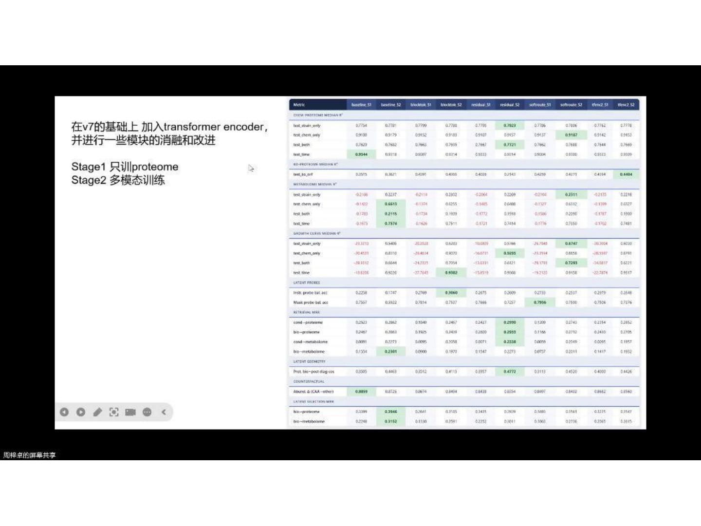

> **概要：** 在 v7 基础上加入 transformer encoder（把每个模态当一个 token）并做模块消融。变体 × 阶段：baseline / blocktok / residual（残差连接）/ softroute（软路由）/ tfenc2，各有 S1（Stage1 只训 proteome）与 S2（Stage2 多模态）两列。全指标表涵盖：chem/KO/metabolome/growth proteome median R²、latent probes（instrument/mask probe acc）、retrieval MRR（cond→proteome、bio→proteome 等）、latent geometry、counterfactual、latent selection MRR。结论方向：Transformer Encoder 主要改善 latent space（如 condition→proteome 的 top1），ko_orf median R² 最优可达 0.44（vs v7 baseline 0.377）。

然后下一步其实就到转录组。转录组我们是没有自己的数据，但我们有公开数据。我觉得之前这一个模拟为什么能够训好，很大程度上原因就是这都是我们自己测的数据，即使每个模拟都不一样，但我们能控制的是这个生物学条件是相似的。但转录组上我们没有这个数据，不过我们有配对的数据——这个配对数据就是我今天说的那 1000 个酵，这 1000 个酵是测了 DNA 的，也测了转录组的。然后我们测了这个 proteome，当然饶赦它们也测了一遍，但它们只有 1800 个蛋白，这个 coverage 还远远不够，所以我们测过来有差不多 3800 个蛋白。所以我们这 969 个 strain 其实是配对的——虽然说每个酵母处理的条件还是有细微差别，但整体上还是可以配对。那这 900 多个就是我们配对的一个来源，我们可以拿种子[?]之类的加进来去做训练。

> **概要：** 下一步规划——加入转录组模态。利用本项目数据中 **969 个 strain 配对的 bulk proteome 与 transcriptome**，把转录组接进模型；同时结合 scYeast（一个生物知识引导的酵母单细胞转录组 foundation model）的 single-cell RNA-seq 数据做增强，并参考其下游任务做比较。右表列出 scYeast 的数据/任务：预训练 ~210k cells、aging GRN inference（125 cells）、growth doubling time（1143 KO strains）、stress classification（117 cells / 4 应激）、TF perturbation response、proteomics transfer（4699 KO proteomes / ~4550 strains）、pan-transcriptome embedding（969 transcriptomes）、YEASTRACT prior（~170k TF-target edges）。讲者观察：scYeast 的表征对下游提升其实很小。

然后同时这篇 paper 叫 SIS[?] 的，它是用 single cell 做了一个预训练，但它这个表得很明显，它这个表征其实对它下游没多大提升，还是比一个最大基（baseline）——最新应该知道，他的提升非常非常小。所以我们就在想，把这个转录组整合进来之后，拿我们这一套模型去得到这个 latent space，去和它们的 latent space 做对比，看会不会对下游任务有帮助。同时这样的话，把转录组接上来[?]之后，我们就完整了，几乎所有的模拟都能够测到，那么比较符合我理解的第一版本 virtual cell 的定义。

——训练数据是？——这里的数据都是自己产生的。这 900 多个是我们自己跑了一遍的，就是 baseline 的这些条件。——900 多个株还是株。对。总共差不多是这样，三万一个 proteome，然后有 4000 个左右的基因 KO（5000 个的 meta（代谢组），以及 1000 多个的生长曲线，差不多这样。
——你说哪个超过一点，你最终版本现在是显著超过吗？——那肯定显著超过，benchmark 之后是同一指标的。你 benchmark 之后是过这个 V0 吧，V0 就已经是所有模型中最好的，我们现在是 V0 基本上在 strain 上提升了 10%。可以看到这个下面，CPA 搞不过我们 V0，这个泰豪可以作证，就是在任何任务上都搞不过。但因为 V0 它的逻辑是整合搞——它通过 Transformer 去硬搞，所以它算得非常非常慢。所以我们现在这个模型架构全部都是 MLP，还没有去改，改的话（同步改了一些版本），去换一些 encoder 确实能够提高。
——V0 已经是目前所有算法中最好的，因为我们之前搞过，现在我们版本是 V0 更好，因为我们搞这个事情搞开之后，会让它变得更可学，就刚刚后面说的，把这个 proteome（理想的 proteome 和观测的 proteome），它能学的东西就会更多。
——你说的更好，是说在指标上更好？——指标表现更好，同时训练上来讲就更轻，然后同时它能够搞这个 latent space，之后那个搞一些这个 space。

——你这个表格怎么看啊？——这个 baseline 的 S2 就是第二阶段，主要的参数吧，就是 S2 这个吧，然后这个是 V7，其他几个是在 V7 上做的改进。你要看 V0 对比的话，看这个就好了，就是这个只拿数据集提升，它 V7 的这个 KO 你可以看到是 0.4，然后我们 V7 baseline 是 0.377，但我们后面改成这个 Transformer Encoder 之后，最好能够达到 0.44，这个提升就非常非常高了。
——其他模型呢？——其他模型是比我们 V0 还差的，这个可以肯定。我们 V0 本身就是之前调了很久的，所以其（在简单基线）非常高搞。我们在这个转录的数据，不管是基因 KO 的数据，还是化合物数动的数据，它都是最好的，同时基因敲除的数据，我们在那个 PD V3[?] 的 human cell line 上，就是浩搞的那些里面，也是比较好的。但现在有个问题，就是你这 KO 的这个数据有 bad case 影响太大了——不过这个问题大家都共这个影响，所以在同一尺度上我们还是能够最好的。

——你的对齐方案也是自己搞的吗？——对啊。
——从这个（SIS）搞了一些什么？你可以问文哥，文哥比较清楚。他搞几个项目，我可以介绍一下。比如他做这个 stress classification 怎么做呢？他搞了不多个细胞——他搞了，是 1117 个 cell line——他测了 4 个刺激条件。然后理论上它这个模型可以输入转录组得到 embedding。然后它做了两个事，一个是我们输入 raw 的转录组数据，通过一个分类任务去做这四个类别，得到一个矩阵；第二个是我们用它这个模型的 embedding 去得到这个矩阵。它实际上用它的 embedding 只是比这个 raw 高了 0.02，这是它自己说的，0.84~0.86 的一个提升。然后在后面很多其他任务上，他这个 benchmark 之后搞得不咋（地），我感觉它从那些可能是挑好的 benchmark 结果搞了的，就是这样。

——KO 的批次更严重，因为它的 variance 最小，它的（生物）信号最小，所以 batch 就更高。
——那（代谢组）都已经接了，就不掉机吧，每天测出来的。——我们不测（细胞），不掉机我们测的是蛋白。蛋白质本身的。我们会有一个洗（呃）离心，离它之后测这个菌体的代谢物。——不是我们的 480，是那个麦维[?] 那边的，他用的好像是 56[?] 吧，还是哪一台，把它去搞。
——所以代谢物整个这个 protocol 其实都不太 OK，它这个流程就不稳定，因为它有胞内代谢物和胞外代谢物。现在我们想测那个胞内代谢物，那只能通过离心搞下洗去搞，那这肯定会有损耗的。
——可以看后面，通过质性之后差不多是一万四千个左右，原始差不多有一万多（几万个）。这个质性就简单按 NA 滤掉——那些 NA 比较高的，比如 80% 的样本都没有，我就认为剩下的 20% 不足以支撑我去学这个事情。什么后用的 1500 多个都是芮[?]搞的，本来那个项目就用的。就没有专门去搭建，比如几个（离）依（之类的），让它（更完善），没有。

——他这边吗，用这个图吧？——这些都加了代谢组。对，然后这个 V0 就是说，我们拿同一个模型架构分别去跑四个子任务，这是一个多任务机器学习。它本质上这个转录组吧、（呃）蛋白组和代谢组它其实是不同的 encoder，它学的不太一样，但是后面就用一个共享的 encoder。然后代谢，之后有一个现象，就是我们后面这个结果——这个结果为什么这里会划分只有化合物划分，因为我们把 strain 划分，发现它搞不上去。因为 strain 它有个问题，就是不同 strain 它起始 OD 不一样，但你不同化合物的搞一个实验，它可以比。不知道能不能理解这个事，不同 strain 它可能一个 OD 是 0.1。另外一个是 0.15 左右，这俩的起始 OD 不一样，就说明它的初始菌量不一样，所以你要去跨那个 strain 去预测比较小难，但同一个酵，我能保证你的起点都是同一个浓度的，因为我是同一个菌液去搞的，所以浓度是一样的，那它这个差值就来自于你加的化合物不同的差值。所以它在化合物的任务上是可以搞的。之后发现它实际上搞一些，但我们不管是通过这种多任务学习。还是把这个搞到一起，发现它这个 strain 可以学了——虽然很差，但确实可以学，有信号在里面。

——这是一定的，要不然也不会做这个多模拟对齐。你可以这样考虑，你这个 condition 的信息实际上是非常丰富的，它只有一部分可能跟你的 protein 有关联，另外一部分可能是去引导其他模拟。因为你拿 protein 去预测代谢，你可能预测不出，但你拿这个先验条件去预测代谢，可能会更准。为什么呢？因为这个更灵活，可以学，更灵活。原本我们 protein 拿它去做这个药物敏感性预测，它都不一定能做好，它的 correlation 可能没有我们想象中那么高。
——对，预测表达谱的同时，我们就可以去搞这个 latent 上的一些东西，比如它这里下游接的用这个 latent 做分类之类的一些任务，就是传统 foundation model 可以做的。
——（怎么）调？首先主任务还是这个 predict，它定了之后你再在其他任务上去调。一开始肯定都低，然后你后面再尝尝加，比如把这个 NCE 提高，让它这个多模拟的表现会不会好一点，你这样去调。然后这个 adversarial 的话，你 0.05 就够了——它学定之后，拿这个 condition 去过这个分类器，它就分不出来了，是 1/9 的概率了，如果不拿进一步去搞。拿 mask 去搞的话，它就能搞得很好。都是有用的。
——（消融）还没来得及做消融呢，前面框架搭起来。这个模型因为它模型很多，所以后面消融时间非常麻烦——因为你开的东西太多了，所以后面就尝尝吧，再把这个码改（一下），看直接去这样做行不行。那这样搞的话，模型还跟后面的 Transformer 没什么差值（就 condition 都是 MLP 啊），没什么差值，然后第二个就搞这个码，看真实通过这个 AE 能不能学到一定的东西。就是可以尝尝看这个消融。但这些 loss 肯定是要的，因为你在设计的时候，你就以它为目标去训练，肯定是要的。比如我们这里有一些 latent 指标，搞这个 condition 到 protein 互相预测的 top one 能搞多少，它在训练的时候就会搞这种东西，所以它肯定是有用的——你如果把这个指标加进，那它从 condition 到 protein 的 map 可能就是 0 了，你不训它肯定就没有，就乱了，随机的。
