# aivc-data-paper 群聊原始转录（含图片）

共 414 条消息，2026-06-15 19:14 → 2026-06-18 14:24；成员：蒋恒、娄含芝、刘佳麟

图片存于 `images/`（共 28 张）。

---

**[2026-06-15 19:14] [系统]  ·(system)**
蒋恒 invited 刘佳麟, 娄含芝 to the chat.

**[2026-06-15 19:16] 蒋恒**
这周之内把论文一起写出来哈

**[2026-06-15 19:16] 蒋恒**
https://github.com/DigitalBiologist/aivc-data-paper

**[2026-06-15 19:19] 娄含芝**
好的老师

**[2026-06-15 19:24] 蒋恒  ·(file)**
<file key="file_v3_0012m_ed6d9356-3805-4960-a01f-7449a3b91edg" name="TM-20260615140140_screen_校对.md"/>

**[2026-06-15 19:24] 蒋恒  ·(file)**
<file key="file_v3_0012m_481e5556-fded-44b5-af4b-ce3ca2f3d04g" name="TM-20260615140140-68710848215-recording-1_screen_from-44m20s.mp4.zip"/>

**[2026-06-15 19:25] 蒋恒**
@娄含芝 含芝做一下这个会议的精校

**[2026-06-15 19:25] 蒋恒**
这是组里一个师兄的项目 对我们项目非常有帮助的

**[2026-06-15 19:26] 蒋恒**
把这个会议里面 每张PPT 截图出来 然后让AI 把截图插入到对应的 markdown 文档里 你做校对 确认AI插入的位置是对的 以及根据截图的一些内容可能会议转录本身会有一些改动

**[2026-06-15 19:26] 蒋恒**
这些材料都不能外传哈 保密要做好 只能在组内流通的

**[2026-06-15 19:27] 蒋恒**
这个对这篇论文是有帮助的 转录出来作为关键context之一

**[2026-06-15 19:28] 蒋恒**
让AI 去做

**[2026-06-15 19:28] 蒋恒**
把现有的论文材料放进这个 repo 里面去

**[2026-06-15 19:28] 娄含芝**
好的老师

**[2026-06-15 19:28] 蒋恒**
https://github.com/DigitalBiologist/aivc-data-paper

**[2026-06-15 19:29] 蒋恒**
整理一下 输入的context 应该分类 : 

外部引用论文 
会议转录材料
我们人的思考和讨论等等

跟AI商量一下  怎么构建一个 clean 的 分类的repo 用来存放论文前期调研材料的

**[2026-06-15 19:30] 蒋恒**
@刘佳麟 你先了解一下含芝的进度 然后之后我们把论文切分出来 一共只用写 1500~2000字 你们一人写 1000字左右就行

**[2026-06-15 19:32] 娄含芝**
好的，我先把具体分类提交给你确认，确认后上传文献，同时我在会议视频里面截取ppt

**[2026-06-15 19:41] [系统]  ·(system)**
蒋恒 invited 刘佳麟 to the group. New members can view all chat history.

**[2026-06-15 20:09] 娄含芝  ·(file)**
<file key="file_v3_0012m_71ae757b-cfa1-4991-baca-cf5ea349169g" name="GitHub仓库架构_待老师确认.md"/>

**[2026-06-15 20:14] 蒋恒  ·(file)**
<file key="file_v3_0012m_86251309-ee35-47a1-b42a-e52fdb6ff83g" name="GitHub仓库架构_待老师确认-蒋恒批注.md"/>

**[2026-06-15 20:15] 蒋恒**
按这个格式要求让AI生成传到 github

**[2026-06-15 20:15] 娄含芝**
好的老师

**[2026-06-15 20:16] 刘佳麟**
老师，有个问题 这篇perspective是练笔用的还是要发出去？

**[2026-06-15 20:16] 蒋恒**
发出去

**[2026-06-15 20:17] 刘佳麟**
okok

**[2026-06-15 22:16] 娄含芝  ·(file)**
<file key="file_v3_0012m_92387d89-afed-4757-8026-6ca0753fffbg" name="20260615虚拟酵母-会议记录配图版.zip"/>

**[2026-06-15 22:21] 蒋恒**
非常好[赞]

**[2026-06-15 22:28] 娄含芝  ·(file)**
<file key="file_v3_0012m_0176d042-6225-4385-929b-651b2d0f044g" name="2026-06-11_webinar_时空input相关提炼.md"/>

**[2026-06-15 22:40] 蒋恒  ·(file)**
<file key="file_v3_0012m_bbc6264b-8c02-455b-9ee9-599e9b3aae0g" name="直播回放-06月11日.mp4.zip"/>

**[2026-06-16 09:41] 娄含芝**
好的老师

**[2026-06-16 09:41] 蒋恒**
设成 public 在群里分享出来

**[2026-06-16 09:41] 蒋恒**
先把github做了

**[2026-06-16 09:41] 娄含芝**
老师我把这个直播回放重新提炼成文档，原文档连同整理后的我一起交给你

**[2026-06-16 10:27] 娄含芝**
老师，我在GitHub上向你发送了邀请

**[2026-06-16 10:27] 蒋恒**
好的 把佳麟拉进去

**[2026-06-16 12:37] 蒋恒  ·(file)**
<file key="file_v3_0012n_0fa95204-c8d0-4453-86c0-b2dfbf1c731g" name="直播回放-06月11日.mp4"/>

**[2026-06-16 12:39] 蒋恒**
@娄含芝 做直播回放校对, 把与虚拟细胞数据相关的讨论部分摘出来理解清晰 ;
@刘佳麟 对目前我们找到的13篇论文快速阅读, 让AI把每篇论文转录成markdown, 再让AI把每篇论文的markdown提取出跟我们论文要论证的观点相关的部分单独保存为markdown

**[2026-06-16 12:40] 娄含芝**
收到老师

**[2026-06-16 12:40] 蒋恒**
有不懂的地方及时问我

**[2026-06-16 12:41] 蒋恒**
可以 试试minerU

**[2026-06-16 12:41] 刘佳麟**
转markdown用minorU吗

**[2026-06-16 12:42] 刘佳麟**
ok我试试

**[2026-06-16 12:42] 蒋恒**
你让 cc 给你安装一个 转录了一篇 你人工验证一下 有没有转录错误的地方

**[2026-06-16 12:43] 蒋恒**
pdf太大了 不适合放到 github 以后每篇论文只放转录的markdown

**[2026-06-16 12:43] 蒋恒**
@娄含芝 以后论文原始pdf 你让Claude 给你 github 仓库加一个 gitignore

**[2026-06-16 12:44] 娄含芝**
好的老师

**[2026-06-16 13:24] 刘佳麟**
刚才用MinerU转了一篇，ai检查说准确率差不多95%这样

**[2026-06-16 13:25] 刘佳麟**
MinerU转的都有图片

**[2026-06-16 13:27] 蒋恒**
不要全依赖ai 这个要自己人眼检查一下的

**[2026-06-16 13:28] 蒋恒**
问问他用的模型是哪一款 mineru有不同宽的模型

**[2026-06-16 13:28] 蒋恒**
尽量都用最好地模型来转录 只要跑得动

**[2026-06-16 13:37] 刘佳麟  ·(image)**
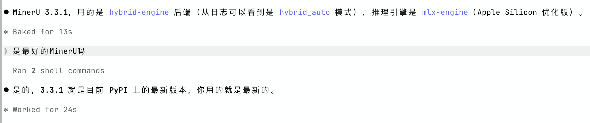

**[2026-06-16 13:37] 刘佳麟**
有一些格式错误比如

**[2026-06-16 13:37] 刘佳麟  ·(image)**
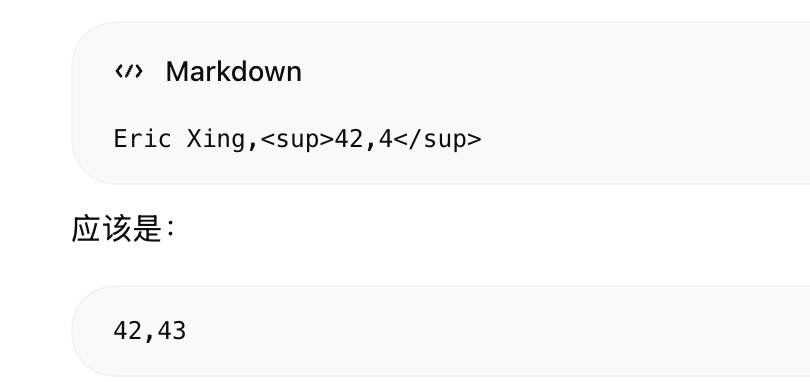

**[2026-06-16 13:38] 刘佳麟**
这个模型

**[2026-06-16 13:41] 蒋恒**
你复制粘贴给cc 让它检查

**[2026-06-16 13:41] 蒋恒**
不是 minerU 有接不同的模型 是底座模型的能力区别

**[2026-06-16 13:42] 刘佳麟**
我看看

**[2026-06-16 14:30] 蒋恒**
@刘佳麟 你那边转录得怎么样了

**[2026-06-16 14:31] 蒋恒**
转录完了 对每篇进行提炼 然后跟 @娄含芝  一起直接把outline 先写出来看看

**[2026-06-16 14:31] 娄含芝**
好的老师

**[2026-06-16 14:32] 蒋恒**
那个视频的内容整理出来了吗

**[2026-06-16 14:32] 蒋恒**
那个视频的讨论内容是比较重要的context

**[2026-06-16 14:34] 娄含芝**
好的老师，正在生成文稿

**[2026-06-16 14:40] 蒋恒**
先简单按文章名字命名就行

**[2026-06-16 14:40] 刘佳麟**
老师，生成出来的文章 markdown命名有指定个格式吗

**[2026-06-16 14:41] 刘佳麟**
好

**[2026-06-16 14:42] 刘佳麟  ·(post)**
除了md，文件夹里会自动生成其他的 比如照片截图，这些需要留着吗？
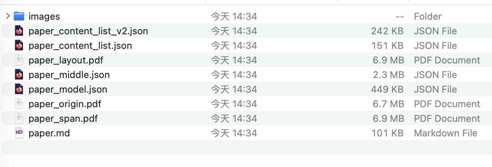

**[2026-06-16 14:45] 蒋恒**
只要这两个 你确定下 paper.md 打开能看到图片不

**[2026-06-16 14:45] 蒋恒**
images 需要保留 , paper.md 保留

**[2026-06-16 14:45] 刘佳麟**
能看到，能看到图片也保留image吗

**[2026-06-16 14:46] 蒋恒**
因为保留了 images 所以才能看到

**[2026-06-16 14:46] 刘佳麟**
哦哦这样

**[2026-06-16 14:47] 蒋恒**
images, pdf 这些对于github来说都太大了 所以我们都不用

**[2026-06-16 14:47] 蒋恒**
其实images 也不用太保留 我们都在GitHub上协作 不要images

**[2026-06-16 14:47] 蒋恒**
因为github本质是为文本/代码类型数据设计的 不支持上传太大的文件格式

**[2026-06-16 14:51] 蒋恒**
生成模型用的什么

**[2026-06-16 14:51] 娄含芝  ·(file)**
<file key="file_v3_0012n_7884e658-3113-458c-b484-09c5ec03b51g" name="outline.md"/>

**[2026-06-16 14:51] 娄含芝  ·(file)**
<file key="file_v3_0012n_6aed3c51-ea0f-4d2b-892a-afac6e9ab96g" name="outline.md"/>

**[2026-06-16 14:51] 娄含芝**
这个是修改后的outline

**[2026-06-16 14:52] 娄含芝**
我让他生成前问了和你差不多的问题

**[2026-06-16 14:52] 娄含芝**
但是和我的上下文有关系

**[2026-06-16 14:52] 娄含芝**
opus4.8

**[2026-06-16 14:53] 娄含芝**
那篇文章是主张先建构模型再把时空加上

**[2026-06-16 14:53] 娄含芝**
他说有一篇文章提到过相似的，但是方向相反

**[2026-06-16 14:54] 娄含芝**
这个应该是受了那篇文章的影响

**[2026-06-16 14:54] 蒋恒**
那篇文章发我一下呢 发我speed-reading版本

**[2026-06-16 14:55] 娄含芝  ·(file)**
<file key="file_v3_0012n_6678e9aa-1588-4745-a20c-37bd160f033g" name="index.html"/>

**[2026-06-16 14:56] 蒋恒**
原文pdf 发我一下

**[2026-06-16 14:57] 娄含芝  ·(file)**
<file key="file_v3_0012n_23546957-df95-4187-8c32-d557db50e2bg" name="paper.pdf"/>

**[2026-06-16 14:58] 娄含芝**
稍等，我重新找一下

**[2026-06-16 14:58] 蒋恒  ·(image)**
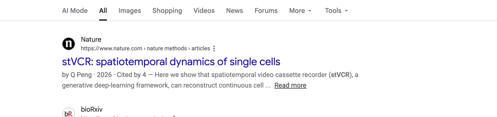

**[2026-06-16 14:58] 蒋恒**
这是预印本吧

**[2026-06-16 14:58] 蒋恒**
发表过的尽量下发表版本

**[2026-06-16 15:03] 蒋恒**
这篇不影响 可以作为我们的 reference 之一

**[2026-06-16 15:04] 蒋恒**
我们主要探讨是从数据搜集角度出发 论述生命科学需要生产什么样的数据

**[2026-06-16 15:05] 蒋恒**
这篇主要是一个建模方法 跟我们出发点不一样

**[2026-06-16 15:06] 娄含芝**
好的老师，我重新弄一篇outline

**[2026-06-16 15:07] 娄含芝**
好的老师

**[2026-06-16 15:07] 蒋恒**
outline暂时不要弄

**[2026-06-16 15:07] 蒋恒**
我们先整理清楚 input context

**[2026-06-16 15:07] 蒋恒**
现在context 没有搜集整理够 生成的outline不会好

**[2026-06-16 15:07] 蒋恒**
先把那个会议录屏做好

**[2026-06-16 15:11] 蒋恒**
明天 2~2.20 开会

**[2026-06-16 15:11] 蒋恒  ·(image)**
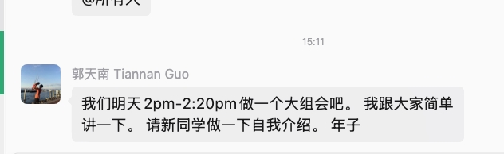

**[2026-06-16 15:15] 娄含芝**
好的

**[2026-06-16 15:15] 刘佳麟**
[OK]

**[2026-06-16 15:45] 娄含芝  ·(file)**
<file key="file_v3_0012n_631895cd-4eb9-4643-bdb6-1fff1fce259g" name="会议信息提取-AIVC-Webinar_面向时空input论文.md"/>

**[2026-06-16 15:45] 娄含芝  ·(file)**
<file key="file_v3_0012n_c0d9811a-a428-4e22-9e59-dd01cc748a0g" name="会议逐字记录-AI虚拟细胞Webinar.md"/>

**[2026-06-16 15:46] 蒋恒**
跟 Agent 协作就是 garbage in garbage out

**[2026-06-16 15:46] 蒋恒**
很好啊 这就是一个干净的 context

**[2026-06-16 15:47] 蒋恒**
下午我们把 outline 给写出来

**[2026-06-16 15:47] 蒋恒**
你们先让AI补充一些 core reference

**[2026-06-16 15:47] 蒋恒**
如果给的 context 很脏 自己没有想清楚 它就很难给你一个干净的output

**[2026-06-16 15:48] 蒋恒**
有不理解的地方及时问我

**[2026-06-16 15:48] 蒋恒**
多找几篇核心的引用论文 然后 转录为 markdown 然后 根据转录markdown 提炼出这篇论文对我们要写的文章最重要的信息/观点 单独作为一个markdown -> 相当于 每篇论文pdf作为输入 两个markdown作为输出

**[2026-06-16 15:50] 娄含芝**
好的老师

**[2026-06-16 15:52] 刘佳麟**
我这里有13篇转好的markdown，但是image link还没删完

**[2026-06-16 15:54] 刘佳麟**
继续删还是提炼markdown弄新的markdown

**[2026-06-16 15:57] 蒋恒**
继续删除吧 删除完开始提炼 markdown 先提炼几篇出来我看看效果

**[2026-06-16 15:57] 蒋恒**
@娄含芝 含芝也是提炼几篇出来看看效果

**[2026-06-16 15:58] 刘佳麟**
好的

**[2026-06-16 15:58] 娄含芝**
好滴我来了

**[2026-06-16 15:59] 蒋恒**
飞书有这种功能 以后点个赞就代表看到就行

**[2026-06-16 15:59] 蒋恒  ·(image)**
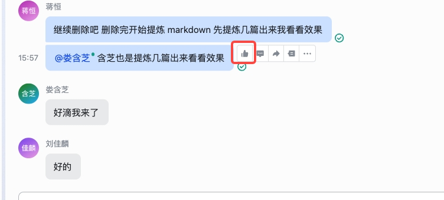

**[2026-06-16 16:00] 蒋恒**
我们群的聊天记录以后也可以用来作为 Agent 的input 所以群聊的内容尽量信息密度大一些

**[2026-06-16 16:31] 娄含芝  ·(file)**
<file key="file_v3_0012n_ae85caf2-efc4-40a2-b4ca-868e54538d0g" name="stVCR - Spatiotemporal dynamics of single cells.md"/>

**[2026-06-16 16:46] 蒋恒**
这个SKILL本质上就是:
给cc的输入是: MinerU 提取了论文PDF之后的 Markdown
cc 应该给我们的输出是: 一份 clean的适合上传到github上作为论文单一 source of truth 的论文markdown (一定要确保忠实原文 不会因为SKILL处理过程中因为 正则匹配偷懒 而误删原文 导致信息遗失的问题)

**[2026-06-16 16:48] 蒋恒**
生成了这个SKILL之后你们一定要亲自去真的读一下SKILL文档本身 你们学习一下一个SKILL是长什么样的 AI有没有理解错误

**[2026-06-16 16:59] 蒋恒**
这是目前为止 这个项目 最重要的 context reference

**[2026-06-16 16:59] 蒋恒**
@娄含芝 整理进我们飞书知识库里

**[2026-06-16 16:59] 蒋恒  ·(file)**
<file key="file_v3_0012n_0732c253-d3cb-4988-893f-fecd7d8c58cg" name="虚拟细胞数据Perspective_Foundational-Context.md"/>

**[2026-06-16 17:00] 蒋恒  ·(post)**
你们把这个完全理解透彻了 然后沿着里面 5. 去搜集整理论文
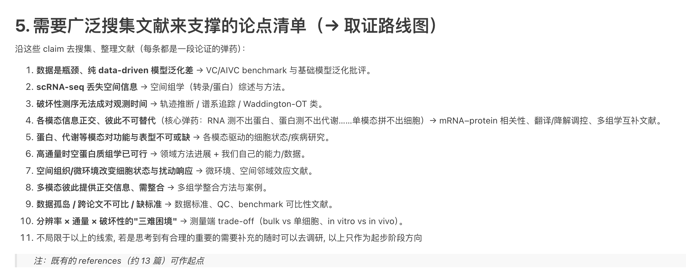

**[2026-06-16 17:02] 蒋恒**
这就是一个成熟管线 你们跑通了就入门 Agent 写作了

**[2026-06-16 17:02] 蒋恒**
先把现在这个[论文markdown清洗]技能开发好, 开发好之后:
找到对应的论文pdf -> minerU 转 markdown -> 用[论文markdown清洗]技能去清洗每篇论文 -> 把这个context x 每篇论文清洗后的markdown 成对传给 Agent 让它根据我们的写作需求 整理出这篇论文对我们文章最重要的论点, 信息等等 作为引用素材

**[2026-06-16 17:03] 娄含芝**
@蒋恒 这个是不是也要上传GitHub

**[2026-06-16 17:03] 蒋恒**
一步步来 不动的地方随时问我

**[2026-06-16 17:04] 蒋恒**
上传啊 这个是 Foundational Context

**[2026-06-16 17:04] 蒋恒**
理解为我们这个项目的种子 , 后面的枝干都是从这里长出来的

**[2026-06-16 17:11] 蒋恒**
用Edit 模式这个意思其实主要是: 让Agent生成这个SKILL的时候跟他说清楚, 一定要是真的去读了原文然后在需要修改的地方用 Edit模式去修改 不能直接偷懒通过正则匹配去批量修改

**[2026-06-16 17:17] 娄含芝**
我放在这个目录下

**[2026-06-16 17:17] 娄含芝  ·(image)**
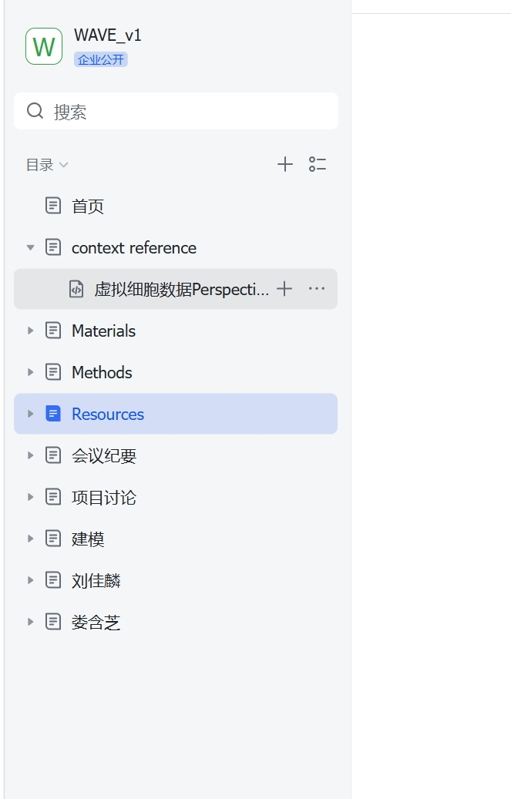

**[2026-06-16 17:45] 蒋恒**
不对

**[2026-06-16 17:45] 蒋恒**
单独创建一个独立的项目

**[2026-06-16 17:46] 蒋恒**
然后在里面创建子文件夹 context references 房里面

**[2026-06-16 17:46] 蒋恒**
AIVC-data-paper

**[2026-06-16 17:55] 娄含芝**
https://kcncys2x2u23.feishu.cn/wiki/LmtewNBJ3ilqxtk8tE8cVoMEnZc?from=from_copylink

**[2026-06-16 17:59] 娄含芝  ·(image)**
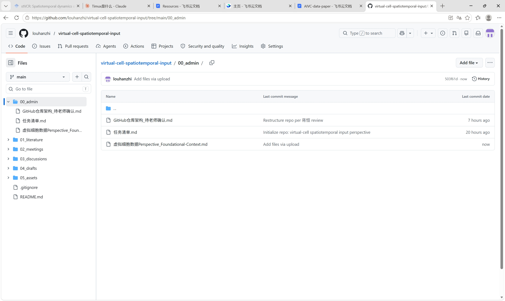

**[2026-06-16 18:01] 蒋恒**
可以 暂时 放 admin吧

**[2026-06-16 18:02] 蒋恒**
一会儿你们生成了技能 用【技能分享】技能 互相用下对方的 然后跑几组对照实验 看哪个版本更好 或者说可以各取所长融合一个版本，你们一定要去看技能文档本身是怎么写的，形成一个最终版

**[2026-06-16 18:03] 蒋恒**
这个是目前任务的管线 技能稳定下来就继续往下推进 去找论文 然后用技能清洗 整理

**[2026-06-16 20:58] 刘佳麟**
老师，跟您汇报一下 我已经把改进的版本发给含芝了，我目前人工看了两篇，除了个别字体粗细和原文不一样外其他没啥问题，含芝的还在改进中 我们明天对比一下 然后做个融合

**[2026-06-16 21:17] 蒋恒**
好的哈

**[2026-06-16 21:40] 娄含芝**
蒋老师，我的也好了，我明天过来多清洗几篇比对一下

**[2026-06-16 21:56] 蒋恒**
好的 明天我们把初版的outline 要做出来 整个管线要跑通一遍

**[2026-06-17 10:30] 刘佳麟  ·(folder)**
<folder key="file_v3_0112o_4273e8f9-f746-4cc4-8e27-1d309d5e7fcg" name="06-Spateo"/>

**[2026-06-17 10:49] 刘佳麟  ·(folder)**
<folder key="file_v3_0112o_0c99f27b-d50e-4c05-a828-bfb4d5ec19bg" name="已清洗（2.0）"/>

**[2026-06-17 10:52] 蒋恒  ·(image)**
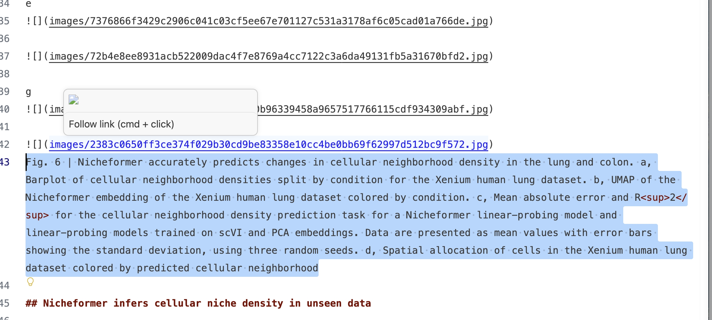

**[2026-06-17 10:52] 蒋恒  ·(image)**
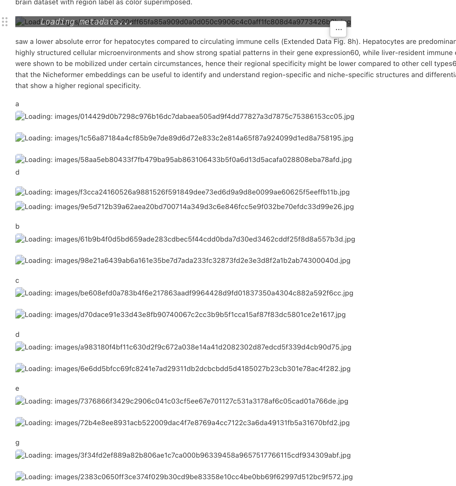

**[2026-06-17 10:58] 刘佳麟**
还可以

**[2026-06-17 10:58] 蒋恒**
速度怎么样

**[2026-06-17 10:58] 蒋恒**
你们的VPN这两天是否稳定?

**[2026-06-17 10:59] 娄含芝  ·(post)**
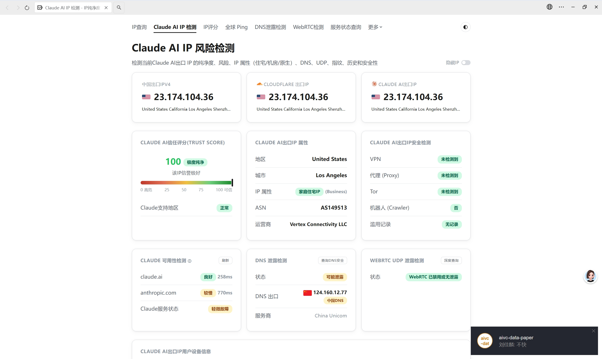
可以的老师

**[2026-06-17 10:59] 刘佳麟**
不快

**[2026-06-17 11:00] 蒋恒**
有没有clash上面能用的

**[2026-06-17 11:01] 蒋恒**
@娄含芝 开始找文献吧 根据 foundational context 用cc或者网页版本都可以 去批量找最重要的文献

**[2026-06-17 11:01] 娄含芝**
这个vpn是个小软件，不知道clash能不能用

**[2026-06-17 11:02] 蒋恒**
现在你们下载论文是不是都能够下载的

**[2026-06-17 11:03] 刘佳麟**
我还没遇到

**[2026-06-17 11:03] 蒋恒**
好的 含芝能下载吗

**[2026-06-17 11:03] 蒋恒**
连的是西湖大学网络吗? 有没有遇到不能下载的论文

**[2026-06-17 11:03] 刘佳麟**
eduroam

**[2026-06-17 11:04] 娄含芝**
我先找几篇文献

**[2026-06-17 11:04] 蒋恒**
现在清洗一篇论文pdf到markdown要多久

**[2026-06-17 11:04] 娄含芝**
我试试

**[2026-06-17 11:04] 娄含芝**
我还没连西湖大学的网络

**[2026-06-17 11:05] 蒋恒**
我把论文下载技能打包发你

**[2026-06-17 11:05] 蒋恒**
那@刘佳麟  负责下载论文 ; @娄含芝 去用佳麟的技能 转录 清晰成markdown

**[2026-06-17 11:05] 蒋恒  ·(file)**
<file key="file_v3_0012o_6439d00b-2acc-41d2-827f-c8c3748ce96g" name="论文下载.zip"/>

**[2026-06-17 11:05] 刘佳麟**
[Invalid text JSON]

**[2026-06-17 11:06] 蒋恒**
开始用 foundational context 发给 cc 或者网页版本 让它去找相关的论文文献 找到了之后 用论文下载技能去逐篇下载

**[2026-06-17 11:06] 蒋恒**
@刘佳麟 让 cc 去学习这个技能; 然后你把这个技能也传到 github 上面去

**[2026-06-17 11:07] 蒋恒**
@娄含芝 你看看你能不能下载论文 ; 主流的各个期刊网站是不是都能下载pdf

**[2026-06-17 11:08] 蒋恒**
先找到相关性 最高的 40 篇论文(包括现在已有的)  然后全部转录清洗了

**[2026-06-17 11:09] 蒋恒**
记得用 foundational context 作为 input 对齐

**[2026-06-17 11:55] 蒋恒  ·(image)**
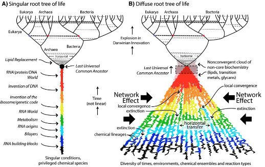

**[2026-06-17 13:06] 蒋恒**
人生法则: 一个程序没有BUG就不要去修它

**[2026-06-17 13:24] 蒋恒**
Claude 封号都是会退钱的

**[2026-06-17 13:24] 蒋恒**
代冲要问清楚封号了能退的

**[2026-06-17 13:39] 蒋恒**
批量并行跑Claude code 关键词: 用 subagent 给我并行处理

**[2026-06-17 13:41] 刘佳麟**
cmux是不是一样的

**[2026-06-17 13:42] 蒋恒**
是一样的

**[2026-06-17 13:43] 蒋恒**
cmux 这里可以直接开多个 terminal 跑不同的 cc

**[2026-06-17 13:43] 蒋恒  ·(image)**
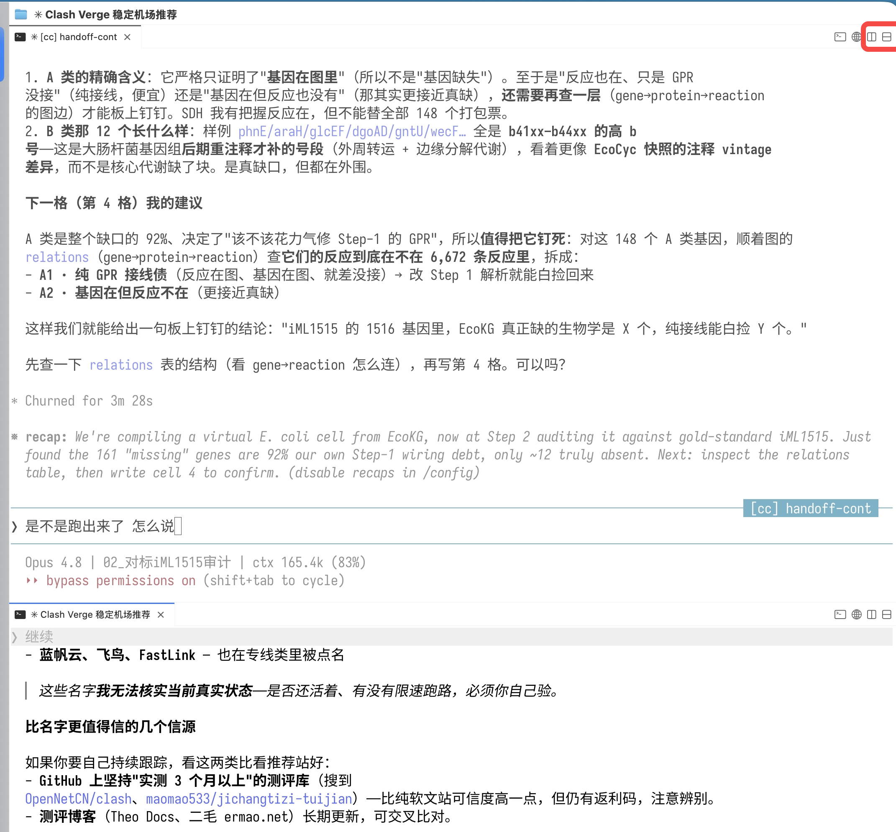

**[2026-06-17 13:43] 蒋恒**
cmux 更方便 多任务

**[2026-06-17 13:44] 蒋恒**
subagent 是在同一个 cc session ; cmux 相当于多一层 可以直接跑多个不同 cc session

**[2026-06-17 13:51] 刘佳麟**
含芝找好了40篇

**[2026-06-17 13:51] 刘佳麟  ·(file)**
<file key="file_v3_0012o_b2bee620-5758-4c79-a73c-1ca7f412be4g" name="candidate-40-literature_2026-06-17.md"/>

**[2026-06-17 13:52] 刘佳麟**
待会是不是把这40篇转更精准的md

**[2026-06-17 13:58] 刘佳麟**
先清洗然后再concentrate?

**[2026-06-17 13:59] 蒋恒**
找到实际对应的文章

**[2026-06-17 13:59] 蒋恒  ·(post)**
$
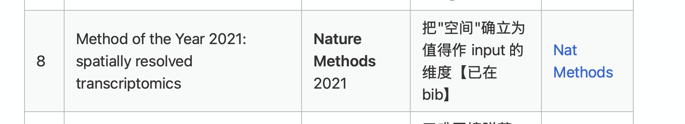

**[2026-06-17 13:59] 蒋恒  ·(image)**
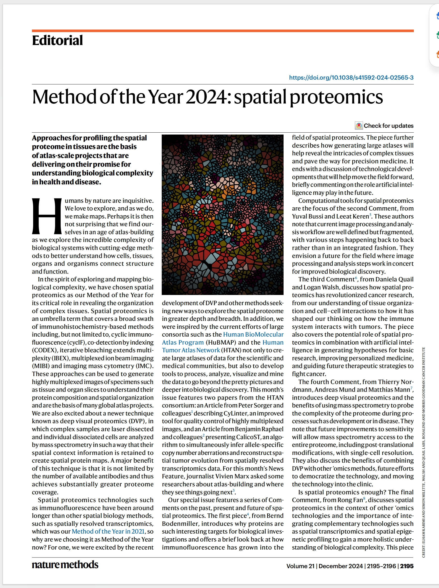

**[2026-06-17 13:59] 蒋恒**
这种不是文章

**[2026-06-17 13:59] 蒋恒**
把这个删除

**[2026-06-17 13:59] 蒋恒  ·(image)**
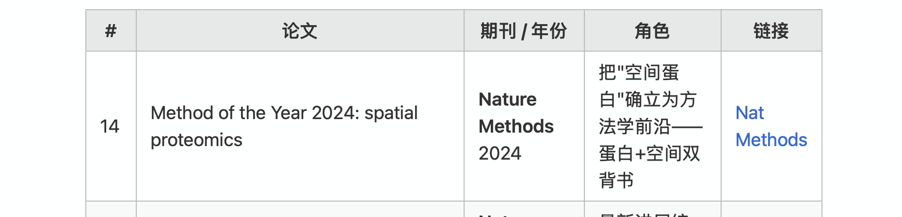

**[2026-06-17 14:00] 蒋恒**
可以去看看这几篇 最重要的

**[2026-06-17 14:00] 蒋恒  ·(image)**
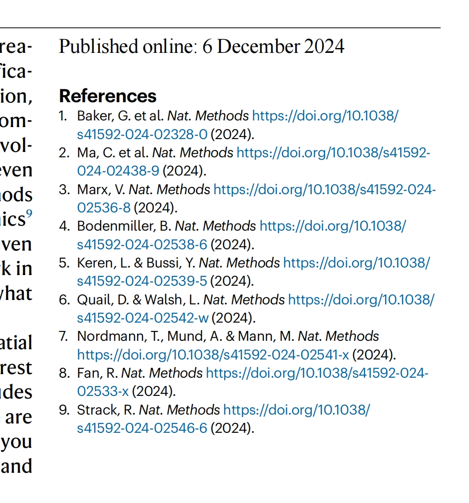

**[2026-06-17 14:04] 蒋恒**
基本上可以 直接先把这一批下载下来

**[2026-06-17 14:04] 蒋恒**
下载了开始转录 清洗 提炼

**[2026-06-17 14:11] 蒋恒  ·(image)**
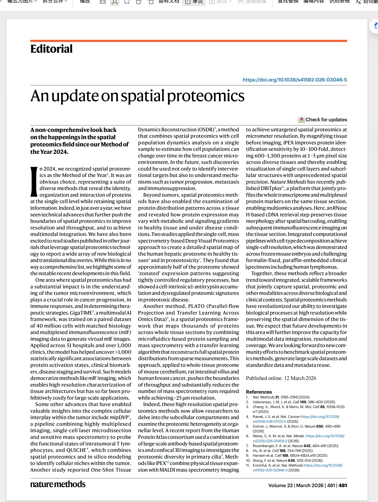

**[2026-06-17 14:11] 蒋恒**
这种文章也不要用 不能引用的 这些如果要用都去看它的reference

**[2026-06-17 14:11] 蒋恒  ·(image)**
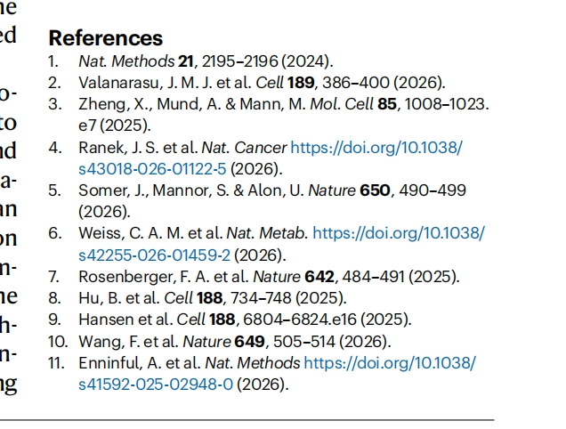

**[2026-06-17 14:27] 蒋恒  ·(image)**
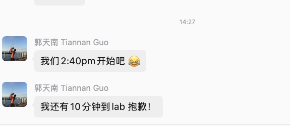

**[2026-06-17 14:36] 蒋恒**
你们定一下怎么协调 Claude Code 拼车吧 方案定了直接在群里通知大家就行

**[2026-06-17 19:22] 蒋恒**
现在到哪一步了

**[2026-06-17 19:23] 蒋恒**
跑了多少了

**[2026-06-17 19:23] 刘佳麟**
清洗转换好的markdown，我俩一人20篇，还在跑

**[2026-06-17 19:24] 蒋恒**
剩下的都发给我 把技能也发给我 我来跑

**[2026-06-17 19:24] 刘佳麟**
我这里跑好12篇

**[2026-06-17 19:24] 刘佳麟**
还没有

**[2026-06-17 19:24] 娄含芝**
我这边跑了五篇

**[2026-06-17 19:24] 蒋恒**
精炼论文的技能开发没有

**[2026-06-17 19:25] 蒋恒**
开发完还是互相测试一下对方的技能

**[2026-06-17 19:25] 蒋恒**
两个人同时开发 开发了看哪个版本效果好

**[2026-06-17 19:25] 蒋恒**
你们去开发精炼技能

**[2026-06-17 19:25] 刘佳麟**
[Invalid text JSON]

**[2026-06-17 19:26] 刘佳麟  ·(folder)**
<folder key="file_v3_0112o_61fa8af1-ee5a-4ff9-92bd-f5c39d5d6b5g" name="清洗论文2.0"/>

**[2026-06-17 19:28] 刘佳麟  ·(folder)**
<folder key="file_v3_0112o_3e934a40-0f5b-43c2-a61f-7c910c60c8cg" name="11-20 & 31-40md（未清理）"/>

**[2026-06-17 19:29] 娄含芝  ·(folder)**
<folder key="file_v3_0112o_b44985d1-4c7a-416d-b29d-4ea34ce178ag" name="21-30MD_PAPER(未清理)"/>

**[2026-06-17 19:29] 刘佳麟**
之前跑的清洗论文还跑吗？

**[2026-06-17 19:29] 蒋恒**
@娄含芝 你剩下的也打包发我吧

**[2026-06-17 19:30] 蒋恒**
是全部都在并行跑还是怎么

**[2026-06-17 19:30] 娄含芝**
剩下的它已经在跑了

**[2026-06-17 19:31] 蒋恒**
你们专心去开发精炼技能 原理知道吗?

**[2026-06-17 19:31] 蒋恒**
停了吧 我来

**[2026-06-17 19:32] 刘佳麟**
给cc 之前的context？原理不知道

**[2026-06-17 19:34] 蒋恒**
先做出来看看吧: 给它之前的context 让它根据我们context里写明的写作论文需求, 把论文中值得学习了解的信息内容等整段原文提炼出来, 跟我们context的相关性总结一下, 对我们论文要论证的点的影响/意义/作用等整理为一个精炼的markdown文档 输出必须是纯英文不能有中文

**[2026-06-17 19:34] 娄含芝  ·(folder)**
<folder key="file_v3_0112o_5de2231f-0e7a-42bf-b908-42fc030afc1g" name="5-10未清理"/>

**[2026-06-17 19:35] 娄含芝**
这两个文件夹都是未清理的

**[2026-06-17 19:35] 蒋恒**
@娄含芝 这两个文件夹的关系是什么

**[2026-06-17 19:36] 娄含芝**
我这边没有了

**[2026-06-17 19:36] 娄含芝**
是的老师

**[2026-06-17 19:36] 蒋恒**
有没有还没有转录的

**[2026-06-17 19:36] 蒋恒**
已经完成转录 但还未清理对吧

**[2026-06-17 19:39] 蒋恒**
论文的 github 仓库是谁在维护

**[2026-06-17 19:52] 蒋恒**
@娄含芝 你的github paper的仓库地址发我下

**[2026-06-17 19:53] 娄含芝**
[louhanzhi/virtual-cell-spatiotemporal-input: Virtual Cell: cell-level spatiotemporal data as input (perspective). Literature, meetings, discussions, drafts.](https://github.com/louhanzhi/virtual-cell-spatiotemporal-input)

**[2026-06-17 19:58] 娄含芝  ·(file)**
<file key="file_v3_0012o_5dee5036-b1bf-4f85-967c-1564c6e576bg" name="提取_Nicheformer.md"/>

**[2026-06-17 19:58] 娄含芝  ·(file)**
<file key="file_v3_0012o_a6bae869-7b95-49b6-ac09-ac5a0bbd98fg" name="Nicheformer - a foundation model for single-cell and spatial omics.pdf"/>

**[2026-06-17 20:01] 蒋恒**
这是用 Opus4.8 做的吗

**[2026-06-17 20:02] 娄含芝**
是的老师

**[2026-06-17 20:03] 蒋恒**
对了 现在你们可以稍微开始注意下 路由(routing)机制:
对于很重要的任务 尽量都用 Opus 4.8 来做 比如生成技能这种之后会复用叠加的事; 
但对于一些很成熟很简单的任务 可以慢慢尝试下放给 sonnet 来做, 比如之前的论文清洗 技能沉淀成熟之后以后执行用 sonnet 就可以

**[2026-06-17 20:04] 蒋恒**
@娄含芝 这个技能可以 把它改成全英文的输出

**[2026-06-17 20:04] 蒋恒**
然后 对于提取论文 精炼这种技能 执行也必须要用 Opus 因为这涉及到对论文本身深刻的理解和洞察 这种需要更高智能的工作 就都用最好的模型去做

**[2026-06-17 20:06] 蒋恒**
技能文件本身发我看看

**[2026-06-17 20:06] 蒋恒**
为啥会说是只对这个目录里的 ?

**[2026-06-17 20:06] 娄含芝**
我这个技能做的很窄，只能针对于我们现在做的这个论文目录下的文献，这样没有问题吗

**[2026-06-17 20:08] 蒋恒**
之前不是Opus做的吗

**[2026-06-17 20:08] 刘佳麟**
精练这个

**[2026-06-17 20:08] 蒋恒**
你是说论文清洗的 Skill?

**[2026-06-17 20:08] 刘佳麟**
我需要重新做一下这个skill，用Opus

**[2026-06-17 20:09] 娄含芝  ·(folder)**
<folder key="file_v3_0112o_e152b616-1826-44c8-89b3-b8b08dc8985g" name="文献提取"/>

**[2026-06-17 20:09] 蒋恒**
嗯 那重新做

**[2026-06-17 20:10] 蒋恒**
对 这种技能写法 也对 也不对 我详细打字说一下 做一个备份:

**[2026-06-17 20:11] 蒋恒**
技能其实分为两种: 1. 可泛化可复用可以跨项目使用的技能  2. 为某个项目特定开发的技能

**[2026-06-17 20:13] 蒋恒**
这个技能稍微改一下 其实就是一个可复用的技能了

**[2026-06-17 20:13] 蒋恒**
其实像论文精炼这件事情 就属于应该开发成可泛化可复用的技能 :
现在你这版本的技能 让AI换个写法 接受两个入参: 一个是context文件(我们提炼的目标和方向) 一个是论文本身 ; 输出是一个根据context文件从全文提炼出来的精炼文档

**[2026-06-17 20:14] 蒋恒**
这样开发出来更好对比和融合

**[2026-06-17 20:14] 蒋恒**
@刘佳麟  独立开发一下这个技能 不用参考含芝的版本

**[2026-06-17 20:16] 蒋恒**
因为每个人思路不一样 开发的prompt 不一样 LLM 本身具有一定的随机性 最后的效果取决于很多因素 ; 独立开发出来可以探索的范围更广 更有可能'撞'到最好的效果 就像进化源自随机的基因突变一样

**[2026-06-17 20:22] 娄含芝**
老师，我把我们的论文主线固化进skill.md,这样可以避免它每次调用folder里的文件

**[2026-06-17 20:23] 蒋恒**
https://www.science.org/doi/10.1126/science.aaf2403#core-collateral-purchase-access

**[2026-06-17 20:24] 蒋恒**
没有的话下载一下发我

**[2026-06-17 20:24] 蒋恒**
@刘佳麟  这个原文pdf发我一下

**[2026-06-17 20:24] 蒋恒**
@娄含芝 没懂呢

**[2026-06-17 20:26] 娄含芝  ·(image)**
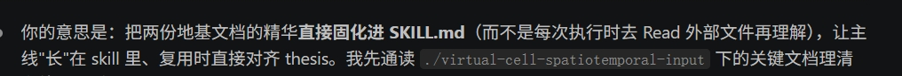

**[2026-06-17 20:26] 娄含芝  ·(image)**
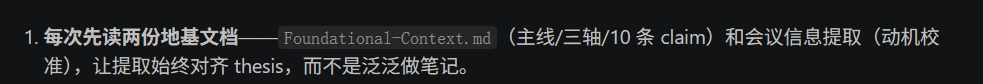

**[2026-06-17 20:40] 刘佳麟  ·(file)**
<file key="file_v3_0012o_e9ee922d-733f-441e-8439-bba06f70791g" name="Visualization and analysis of gene expression in tissue sections by spatial transcriptomics.pdf"/>

**[2026-06-17 20:46] 刘佳麟  ·(folder)**
<folder key="file_v3_0112o_76d672bf-93c6-403d-85b4-a22440f2f03g" name="已清洗（2.0）"/>

**[2026-06-17 20:46] 蒋恒**
@娄含芝 全部整理到github

**[2026-06-17 20:46] 蒋恒  ·(file)**
<file key="file_v3_0012o_be672ad2-3166-47ce-9079-08f36c139ccg" name="论文清洗完成_260617.zip"/>

**[2026-06-17 20:46] 蒋恒**
subagent

**[2026-06-17 20:48] 蒋恒**
github 上传的时候 让它 gitignore pdf 格式

**[2026-06-17 20:54] 刘佳麟**
用Opus跑完了一篇，我不确定要改哪里

**[2026-06-17 20:54] 刘佳麟**
精练这个

**[2026-06-17 20:54] 蒋恒**
发我看看

**[2026-06-17 20:55] 蒋恒**
都发我一下

**[2026-06-17 20:55] 刘佳麟**
skill还是跑完的

**[2026-06-17 20:58] 蒋恒**
@娄含芝 你的论文精炼技能更新了没

**[2026-06-17 20:58] 娄含芝**
更新了，我正在跑一篇论文试试

**[2026-06-17 20:59] 蒋恒**
你们互相用下对方的技能 两个技能来精炼同一篇论文对比一下 看哪个效果更好一些 还是说融合一下更好

**[2026-06-17 20:59] 刘佳麟  ·(folder)**
<folder key="file_v3_0112o_2b959e6a-02cf-4ddb-84ca-2d04f86a71bg" name="精炼（Trial）"/>

**[2026-06-17 21:01] 娄含芝  ·(folder)**
<folder key="file_v3_0112o_8096a11d-c1a5-4a00-9cb7-3c0a897300eg" name="论文论点提取"/>

**[2026-06-17 21:01] 蒋恒**
@刘佳麟 这个挺好的 这就是可以复用的技能样子

**[2026-06-17 21:02] 蒋恒**
我给你说怎么改 你给它说这个prompt:

**[2026-06-17 21:02] 蒋恒**
这个还是太 项目-specific 了

**[2026-06-17 21:02] 蒋恒  ·(image)**
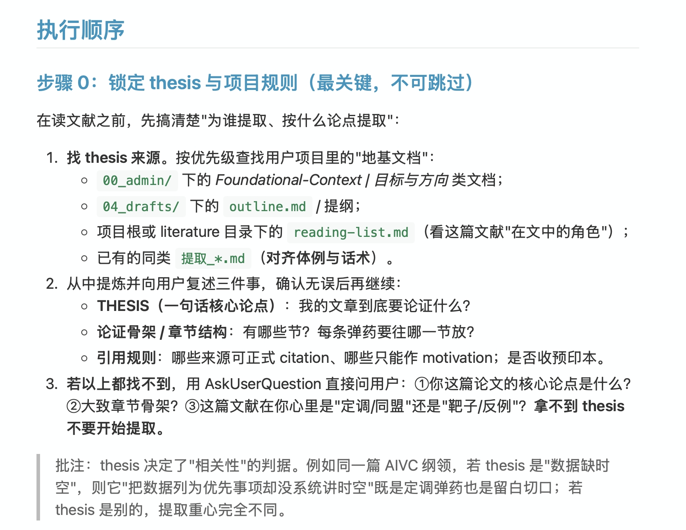

**[2026-06-17 21:03] 蒋恒**
这个技能太项目-specific了 我希望你给我转化成一个可复用的更泛化的技能 接受两个文件 一个是我们提炼的目标和方向的context 一个是论文本身 , 根据这两个文件 输出为一个精炼版本的可以用来指导我们下游下作任务的文档 输出文件要求全英文

**[2026-06-17 21:04] 蒋恒**
直接把这个作为prompt发给你的cc

**[2026-06-17 21:13] 娄含芝  ·(file)**
<file key="file_v3_0012o_85837423-de3b-4506-b84f-6404c12cf22g" name="SKILL.md"/>

**[2026-06-17 21:15] 蒋恒**
@娄含芝 很好啊 这就是一个可复用的技能了

**[2026-06-17 21:15] 蒋恒**
你对比一下你的技能和 佳麟技能的输出质量

**[2026-06-17 21:16] 蒋恒**
用同一篇论文 两个技能分别跑一下 然后让Agent评估哪个质量更高 还是可以融合成更高的

**[2026-06-17 21:39] 刘佳麟  ·(file)**
<file key="file_v3_0012o_d678d095-1175-4e38-8328-398bc8cce97g" name="Agent-Skill-入门教程.md"/>

**[2026-06-17 21:50] 娄含芝  ·(file)**
<file key="file_v3_0012o_e00e9ba5-0c69-4abe-90c1-fcd57a4ed7dg" name="已清洗_260617.zip"/>

**[2026-06-17 21:55] 娄含芝  ·(folder)**
<folder key="file_v3_0112o_df00efdd-27b0-4ee5-9d46-a9d69a787c9g" name="预印本_已清洗"/>

**[2026-06-17 21:55] 娄含芝**
这是清洗好的40篇论文，之前的13篇论文中有3篇没有在里面，因为这3篇是预印本，我另外放一个文件夹

**[2026-06-17 21:56] 蒋恒**
很好哈 明天初稿就能写出来了

**[2026-06-17 21:56] 娄含芝**
我把一样的文献进行提炼，提炼后的版本已经发给佳麟，我们明天进行核对

**[2026-06-18 09:44] 蒋恒**
第一步一定要做快一点 你们快点对比融合精炼的技能 给出一个 definitive 的版本 然后给我来跑 我给你们看怎么样批量跑任务 然后就开始写 outline 写论文了

**[2026-06-18 09:45] 蒋恒**
Agent 目前不是万能的 有些人看很obvious 的 它反而看不出来

**[2026-06-18 09:45] 蒋恒**
不能全部依赖 Agent 来判断 一定要人读 不一定读完 但要把关

**[2026-06-18 10:17] 蒋恒**
可以

**[2026-06-18 10:17] 刘佳麟**
现在通过肉眼对比：含芝的版本对每个quote解释更多，更全面。而且会记得之前精练过的其他文章 含芝多一个indirect material 的section 我的版本，quote数量会更多，对于quote的解释融合在relevance to perspective 和impact on argument这两个section 我多一个figure/data worth citing的section 我们两个的版本都有给quote分配合适的paragraph 现在给agent看看？

**[2026-06-18 10:29] 刘佳麟  ·(file)**
<file key="file_v3_0012p_854ea1cd-d6dc-44ad-a272-ca7bff4d7a4g" name="精练skill_改进意见.md"/>

**[2026-06-18 10:29] 刘佳麟**
这个是cc给的意见

**[2026-06-18 10:29] 蒋恒**
直接跑一个版本出来 和你昨天做的版本对比

**[2026-06-18 10:30] 刘佳麟**
对比昨天的

**[2026-06-18 10:30] 刘佳麟**
是跑一个我俩的融合版本？然后对比？

**[2026-06-18 10:30] 蒋恒**
对比的时候新开一个cc窗口 客观对比

**[2026-06-18 10:31] 蒋恒**
@娄含芝 你去做 outline的技能

**[2026-06-18 10:31] 蒋恒**
把技能根据改进意见更新一版 然后用新的技能跑一个精炼版本 对比昨天的精炼版本

**[2026-06-18 10:32] 蒋恒**
outline 主要是 写论文的框架 不是正文 就是理清楚整个行文思路 然后每部分的引用文献用哪些

**[2026-06-18 10:56] 刘佳麟  ·(file)**
<file key="file_v3_0012p_01ffc60a-f4df-4397-ae69-95148f1cdbag" name="精练skill_三版批判与改进v2.md"/>

**[2026-06-18 10:56] 刘佳麟**
这个是对比融合版本我俩的昨天的版本

**[2026-06-18 10:57] 蒋恒**
把实际跑出来的精炼论文发我

**[2026-06-18 10:58] 刘佳麟  ·(file)**
<file key="file_v3_0012p_57ff0002-c80c-4cce-a517-b192c73feedg" name="03-Preclinical_refined2.0.md"/>

**[2026-06-18 11:00] 蒋恒**
同一篇论文 不同版本技能 跑出来的不同版本精炼

**[2026-06-18 11:00] 蒋恒**
有没有 side-by-side 对比版本

**[2026-06-18 11:00] 蒋恒**
跟昨天你发我的是同一篇吗

**[2026-06-18 11:01] 蒋恒**
@娄含芝 @刘佳麟  你们都在 vscode 里面装一个统计 markdown 文档 token 的插架 让Claude帮你们装好 确定能看到每篇markdown的token数量

**[2026-06-18 11:03] 刘佳麟  ·(folder)**
<folder key="file_v3_0112p_eccb3b64-f5f3-4732-b70c-290bd75fad7g" name="精炼（Trial）"/>

**[2026-06-18 11:13] 蒋恒**
你最初那一版本的精炼skill 再发我一下 刚才那个文件夹里有吗 @刘佳麟

**[2026-06-18 11:14] 刘佳麟  ·(folder)**
<folder key="file_v3_0112p_b9c2bb2e-45d6-4dc5-ad70-b541f9c7257g" name="jinglian-distill-kit"/>

**[2026-06-18 11:20] 娄含芝  ·(file)**
<file key="file_v3_0012p_6714e4bb-f3fe-4170-b339-01425508ab7g" name="outline.md"/>

**[2026-06-18 11:21] 蒋恒**
可以的 作为练习很好

**[2026-06-18 11:21] 蒋恒**
我们一会儿一起来写 outline

**[2026-06-18 11:21] 娄含芝**
老师你看看这个outline会不会有点长，需不需要在修改，有修改的地方我把skill一起改了再把skill发给你

**[2026-06-18 11:22] 蒋恒**
真的outline需要精炼结果才能写出来

**[2026-06-18 11:22] 娄含芝**
好的，那先我做成一个可复用的skill

**[2026-06-18 11:23] 蒋恒**
今天改了之后有点过度工程化

**[2026-06-18 11:23] 蒋恒**
@刘佳麟 佳麟昨天的那个 精炼 skill 很好

**[2026-06-18 11:24] 蒋恒**
昨天佳麟那版其实已经做得很好

**[2026-06-18 11:24] 蒋恒**
只是让你们试试 正好大概理解下什么样的产出是合适的

**[2026-06-18 11:25] 蒋恒**
嗯 我在改

**[2026-06-18 11:25] 刘佳麟**
那昨天的需要小改一下吗

**[2026-06-18 11:26] 蒋恒**
你们要多体会感悟一下 什么样的信息对于Agent处理下游任务是最友好的

**[2026-06-18 11:26] 蒋恒**
是这样的: 
Agent 把事情做复杂很简单 , 我们需要的其实是每一步都有clean的Intermediate result 这样才能作为下游任务的输入

**[2026-06-18 11:28] 娄含芝  ·(file)**
<file key="file_v3_0012p_b53bff84-026b-4b2e-9d0a-44fa624c923g" name="虚拟细胞数据Perspective_Foundational-Context.md"/>

**[2026-06-18 11:28] 蒋恒**
我们的context文件发我一份

**[2026-06-18 11:32] 刘佳麟**
[Invalid text JSON]

**[2026-06-18 11:32] 蒋恒  ·(file)**
<file key="file_v3_0012p_c30ae11b-34d8-4284-bdc3-d442a6e82f9g" name="精练3.0-index.md"/>

**[2026-06-18 11:32] 蒋恒**
你们保存一下这个版本的技能 作为现在的标准版本使用

**[2026-06-18 11:33] 蒋恒**
大概理解一下这个技能为什么这么些

**[2026-06-18 12:57] 娄含芝  ·(file)**
<file key="file_v3_0012p_824a0f75-b039-4b1e-bf0f-68a80fe6c76g" name="SKILL.md"/>

**[2026-06-18 13:14] 娄含芝**
不是的老师，我总结了步骤给ai生成的

**[2026-06-18 13:14] 蒋恒**
可以的 这是参照精炼技能生成的吗

**[2026-06-18 13:15] 蒋恒**
嗯 这一步其实会更复杂一些 我带你们来做下

**[2026-06-18 13:22] 娄含芝**
老师，方便把生成的精炼版发给我吗，我整理一下放进github

**[2026-06-18 13:23] 蒋恒**
整理一下

**[2026-06-18 13:23] 蒋恒  ·(file)**
<file key="file_v3_0012p_0e1d11ee-730a-4084-b838-20c8dfe686eg" name="已清洗_260617.zip"/>

**[2026-06-18 13:24] 娄含芝  ·(image)**
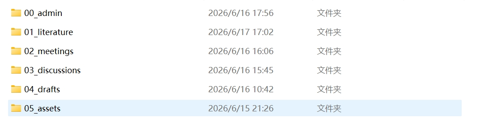

**[2026-06-18 13:24] 蒋恒**
还记得那 6 步吗 把github 整理成六步的形式

**[2026-06-18 13:25] 蒋恒**
context -> pdf -> clean-markdown -> extraction -> outline -> paper

**[2026-06-18 13:25] 蒋恒**
重新开一个 github

**[2026-06-18 13:27] 蒋恒**
不要放

**[2026-06-18 13:27] 蒋恒**
不要房

**[2026-06-18 13:27] 蒋恒**
从零 fresh start

**[2026-06-18 13:27] 娄含芝**
意思是我把这些内容放在相应的文件夹中

**[2026-06-18 13:28] 蒋恒**
可以

**[2026-06-18 13:28] 娄含芝**
这些本身作为一个空的文件夹吗

**[2026-06-18 13:28] 刘佳麟**
要不github我来弄吧？ 我还没试过

**[2026-06-18 13:28] 蒋恒**
@娄含芝 开发一个飞书技能

**[2026-06-18 13:28] 蒋恒**
佳麟也试试

**[2026-06-18 13:29] 蒋恒**
让cc 去把我们整个 aivc-data-paper 的聊天记录扒下来

**[2026-06-18 13:31] 蒋恒**
给它说这个东西试试

**[2026-06-18 13:31] 蒋恒**
lark-cli

**[2026-06-18 13:38] 蒋恒**
@娄含芝 去调研下 我给你文档 你去找对应的论文作为我们新增 reference

**[2026-06-18 13:38] 蒋恒  ·(image)**
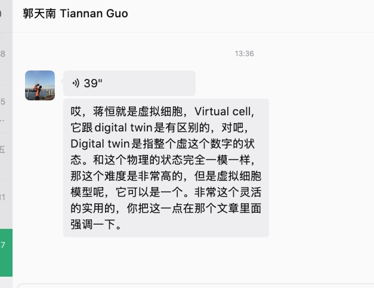

**[2026-06-18 13:50] 蒋恒**
不是的 只是把我们的工作流程实际在GitHub中整理出来 可以作为以后工作的模板

**[2026-06-18 13:50] 刘佳麟  ·(image)**
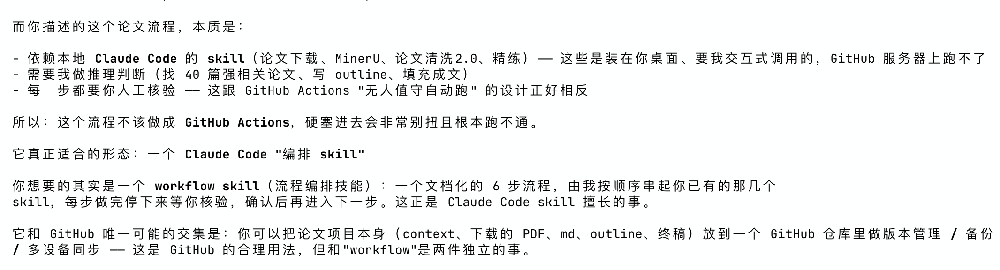

**[2026-06-18 13:50] 刘佳麟**
老师，确认一下 这个GitHub的用途是存储之前创造的skill？我有点不确定了

**[2026-06-18 13:51] 蒋恒**
命名文件夹

**[2026-06-18 13:51] 蒋恒**
比如说

**[2026-06-18 13:51] 蒋恒**
这样

**[2026-06-18 13:51] 蒋恒  ·(image)**
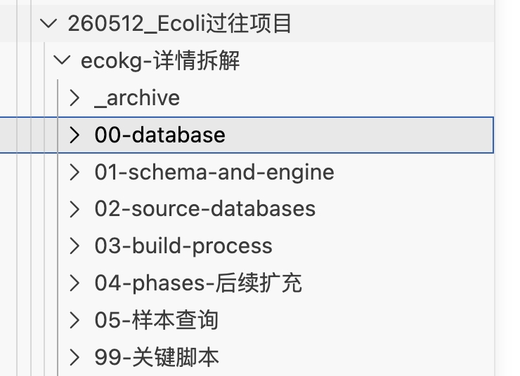

**[2026-06-18 13:52] 蒋恒**
就是一个时间顺序的步骤 以后可以照着这个模板一步一步来做的 标准化流程

**[2026-06-18 14:00] 蒋恒  ·(file)**
<file key="file_v3_0012p_b8b72281-8b07-4a84-9df4-1b3fe125264g" name="_虚拟细胞数据Perspective_补充_VC-vs-DigitalTwin_含v2地基.md"/>

**[2026-06-18 14:00] 蒋恒**
@娄含芝 把这几篇对应的论文找到

**[2026-06-18 14:01] 娄含芝**
老师，考虑到聊天内容经常更新，我让ai把每次更新结合前面的汇总版放在飞书云端，把每次更新的部分放在本地电脑储存，这个方案可以吗

**[2026-06-18 14:02] 蒋恒**
这个佳麟去下载吧 含芝好像下不了

**[2026-06-18 14:02] 蒋恒**
@刘佳麟 你那里有论文下载技能对吧

**[2026-06-18 14:02] 蒋恒**
整理出来打包发给我

**[2026-06-18 14:02] 蒋恒**
先放到本地就行 让本地能够有一个按时间顺序整理出来的聊天记录 包含文件的

**[2026-06-18 14:02] 蒋恒**
直接把新增的补充引用论文下载了

**[2026-06-18 14:03] 蒋恒**
不用总结

**[2026-06-18 14:03] 娄含芝**
那如果之后要聊天记录要再次总结，是不是只需要存放多出来的部分

**[2026-06-18 14:04] 蒋恒**
开发成一个稳定的能拿到原始聊天记录的技能就行 总结是很简单的没必要开发技能

**[2026-06-18 14:04] 蒋恒**
每次聊天记录更新直接 append

**[2026-06-18 14:04] 蒋恒**
就要原始的内容就行

**[2026-06-18 14:05] 蒋恒**
但AI总结就是一句话的事情: 给它原始聊天记录 给他说去总结 就可以了;

**[2026-06-18 14:05] 蒋恒**
这样来理解: 为了拿到结构化的聊天原始记录 是需要代码 + API + 固定流程 是一件挺复杂的事 我们要的是可复用 稳定性

**[2026-06-18 14:10] 蒋恒**
可以的

**[2026-06-18 14:10] 娄含芝**
老师，我把这份补充地基加到main中去，作为我们的fundamental context

**[2026-06-18 14:19] 娄含芝**
聊天中的image需要保留吗

**[2026-06-18 14:20] 蒋恒**
要的

**[2026-06-18 14:21] 刘佳麟  ·(folder)**
<folder key="file_v3_0112p_b68bbfc9-142b-4b09-8b07-9983d9fa4b5g" name="v2补充论文"/>

**[2026-06-18 14:22] 蒋恒**
ok 去转录了清洗一下吧

**[2026-06-18 14:23] 刘佳麟**
https://github.com/Twinkle-Twwinkle/paper-writing-workflow

**[2026-06-18 14:24] 蒋恒**
@刘佳麟 去把补充论文转录了清洗一下

**[2026-06-18 14:24] 蒋恒**
@刘佳麟 这个就是我们要的东西 以后可以直接迭代的流程

**[2026-06-18 14:24] 蒋恒**
对的 就是这个意思
